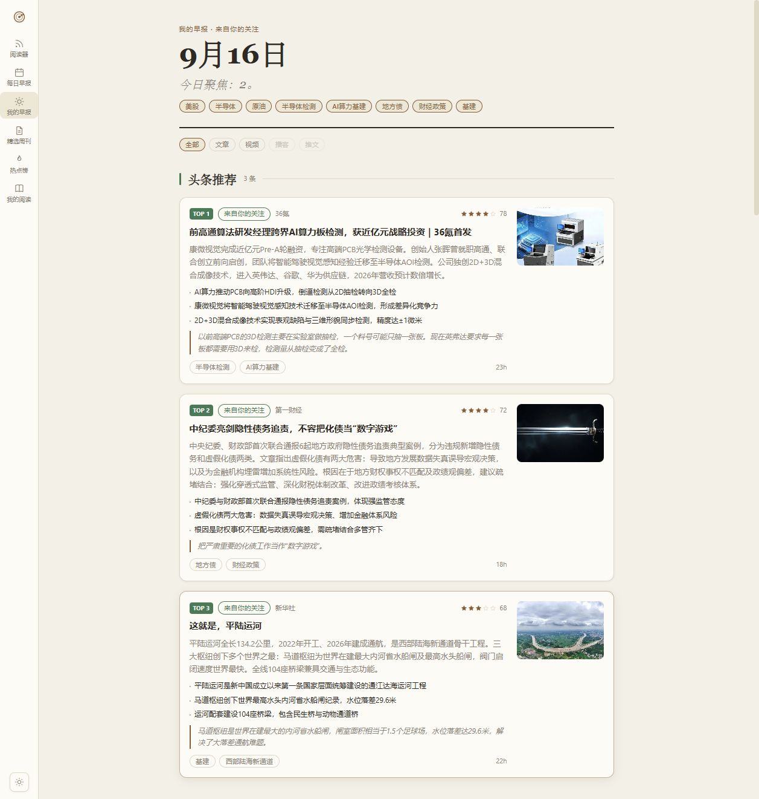
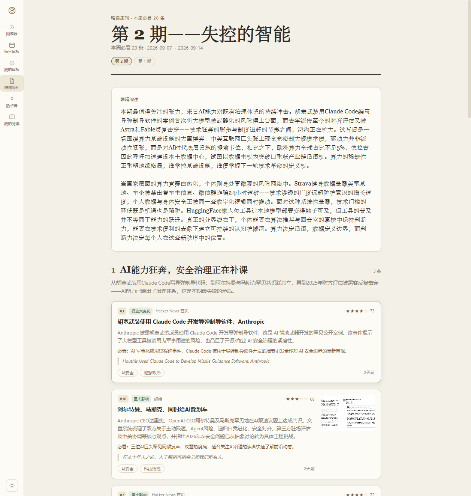
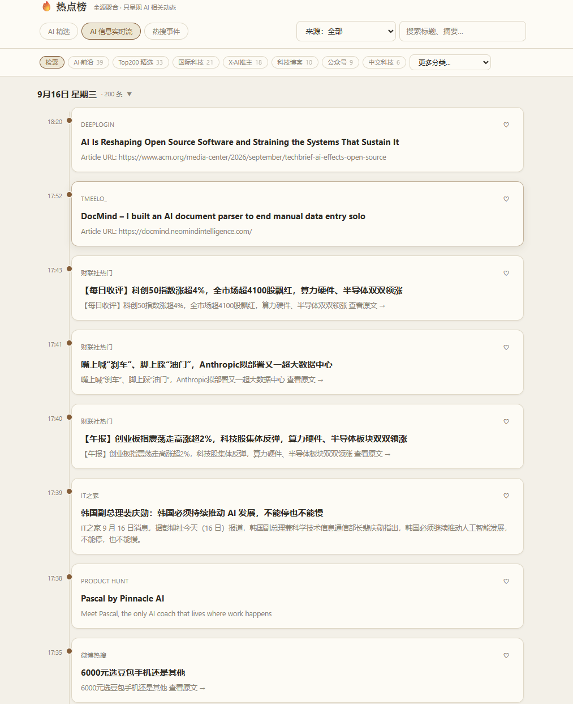
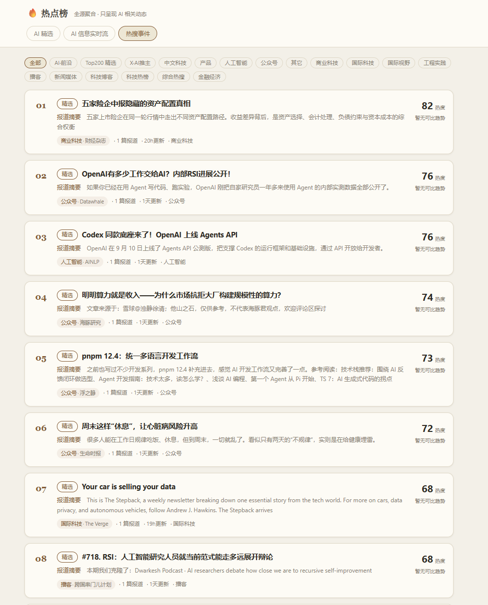
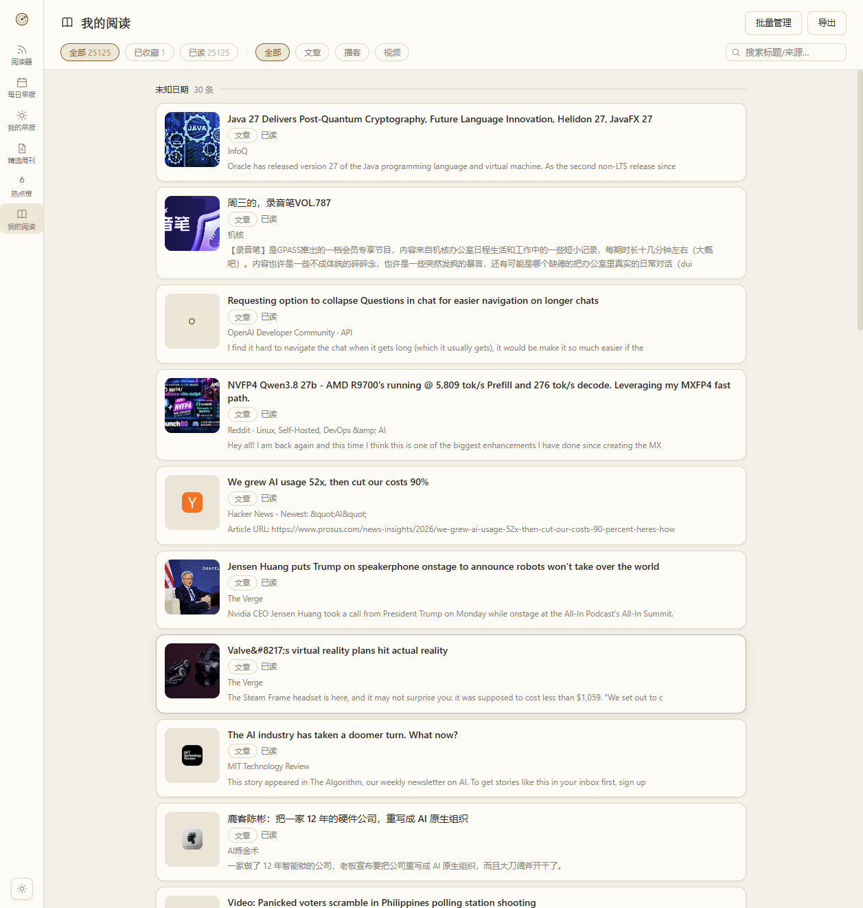
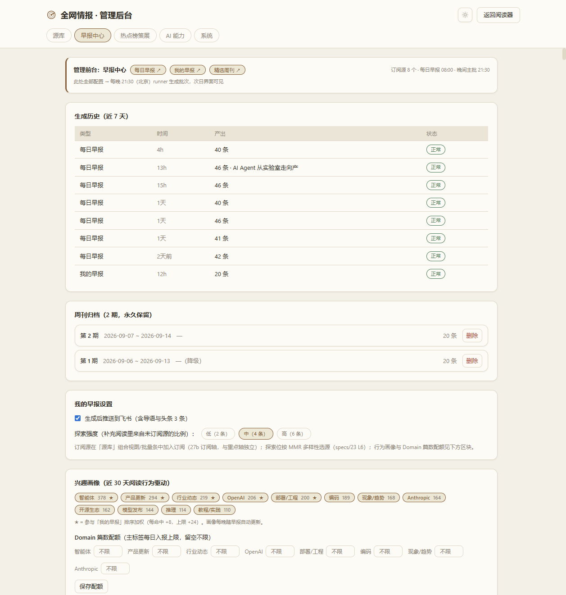
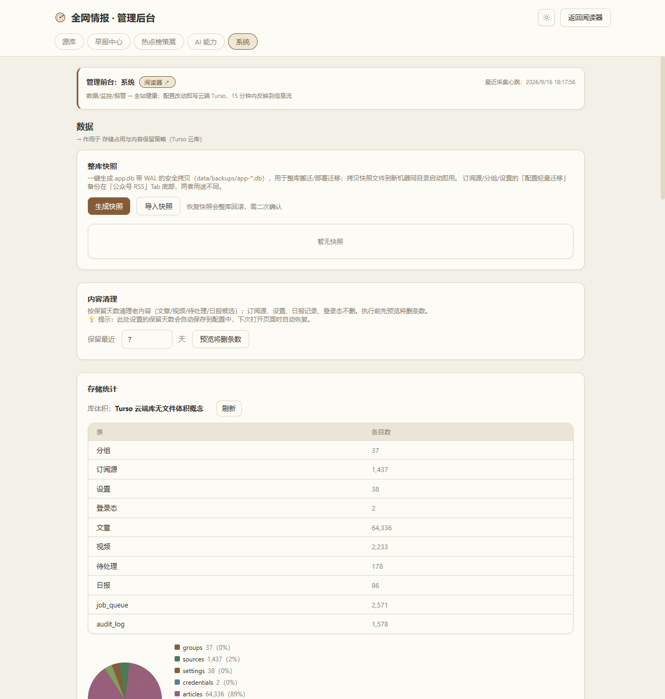

# QWis Portal — 全网情报系统

> **Q**uan**W**ang **I**ntel **S**ystem — 私人 AI 情报阅读器
>
> 聚合 RSS、微信公众号、B站、抖音、X/Twitter、热榜等多源信息，自动生成每日情报日报与个性化早报，支持 AI 辅助分析、翻译、精选周刊和多端推送报警。
>
> **生产地址**：<https://qwis-intel.vercel.app>

[](#)
[](#)
[](https://qwis-intel.vercel.app)

---

## ✨ 核心功能

### 📡 多源采集

| 源类型 | 采集方式 | 说明 |
|--------|----------|------|
| **RSS / Atom** | `rss-parser` | 通用 RSS 适配器，含 `content:encoded` 全文保留、ETag 304 短路、GBK/Big5 编码嗅探、Readability 正文提取 |
| **微信公众号** | wechat2rss 托管 RSS | 375 个 bestblogs 源，图片由对方 img-proxy 代理 |
| **B站视频** | wbi 签名 API | 合集/搜索兜底，匿名 buvid Cookie，playurl 直链解析 |
| **抖音视频** | Playwright headless | 扫码登录，严格串行 ≥10s 间隔，仅本地运行 |
| **热榜聚合** | newsnow API | 微博/知乎/百度/头条/抖音/B站/贴吧/澎湃/凤凰等 29 个热榜源 |
| **YouTube** | 官方频道 RSS | 需代理可达 |
| **X / Twitter** | RSSHub | 依赖第三方 RSS 服务将时间线转为 RSS |
| **播客音频** | RSS enclosure | 音频直链 + 封面归位，阅读器内嵌播放器 |

### 📰 每日情报日报 & 早报体系

- **每日早报**：四栏目布局（培训课程 / 重点更新 / AI 技术 / 其它重要），每日 08:00 + 晚间 21:30 双批次生成
- **我的早报**：个性化订阅源 + 智能推荐，基于用户关注分组加权
- **精选周刊**：AI 策展周度精选，主题全景四视角
- **智能生成流程**：候选收集 → 关键词分类 → Jaccard ≥0.5 去重 + 同源限流 → 出库安检（乱码/风控错误页过滤）
- **破茧栏**：事件聚合引擎，与用户常读分组交集最小的 Top5 事件
- **AI 增强**：摘要/评分/标签/翻译（多轮精翻管线 + 中英对照）

### 🔥 AI 热点榜

- **AI 精选**：自有源六维 ≥60 且 AI 相关，热榜源不入精选
- **AI 信息实时流**：只出 AI 相关内容，60s 无感刷新
- **热搜事件**：近 72h 全域条目 Jaccard(≥0.4) 聚类，热度 = Σ权重 × 24h 半衰 × 1.5^(信源数-1)，24 桶趋势折线
- **分类胶囊**：AI·前沿 / Top200 精选 / 国际科技 / X·AI推主 / 科技博客 / 公众号 / 中文科技 等
- **enrich 管线**：pending_items → 串行详情页解析 → 富字段入库

### 🚨 报警系统

- **7 渠道**：钉钉 / 企微 / 飞书 / Server酱 / Bark / Telegram / 自定义 webhook
- **4 事件类型**：源熔断 / 采集停滞 / 队列异常 / 系统错误
- **防骚扰**：120min 冷却期 + 代理失败直连重试

### 📋 源库管理与源四轴模型

- **四轴语义**：上架（enabled）→ 收录（reader_visible）→ 订阅（subscription）→ 重点（spotlight）/ 屏蔽（muted）
- 全类型源统一列表，三视图（组合卡片 / 问题源 / 检索）+ 平台接入 + 搜索 + 本地分页
- 批量操作：启用/停用/特别关注/移动/屏蔽/收录（组级单条 SQL，云端 serverless 友好）
- **自动分类**：内置 8 类目录（中英别名归一 + 关键词兜底），新源三挂接点自动入组
- 存量回填 dryRun 预览 → 勾选确认 → apply

### 🔄 云端队列同步

- 手机端/桌面端通过 HTTP Shortcuts 提交链接到云端 PHP 队列
- 本地 poller 每 10min 拉取 → 写入 pending_items → 清空云端
- 云端（Vercel）已支持 `POST /api/queue/sync` 直接触发同步
- 支持 B站视频、抖音视频、公众号文章三队列

### 🛡 鉴权与数据安全

- **JWT 鉴权**：读者只读 GET 公开，写操作与管理接口需 Bearer Token（7d 有效）
- **整库快照备份**：WAL 安全 backup → `data/backups/app-*.db`
- **按天清理**：可配置 retentionDays（默认 7 天）
- **熔断机制**：源连续失败 3 次自动停用，修好后手动启用清零 fail_count

---

## 🖥 页面预览

> 以下截图均来自线上生产环境 <https://qwis-intel.vercel.app>（2026-09-16 截取）。

### 阅读器 (`/reader/`)

文章/视频双 Tab + 分组导航 + 今日早报摘要卡 + 「今日」滚动 24h 视图 + 未读计数


### 每日早报 (`/daily/`)

四栏目布局（培训课程 / 重点更新 / AI 技术 / 其它）+ 统计卡片 + 破茧栏 + AI 评分/摘要 + 中英对照


### 我的早报 (`/mybrief/`)

个性化订阅源 + 智能推荐 + 主题导语 + 阅读足迹回顾



### 精选周刊 (`/weekly/`)

AI 策展周度精选 + 主题全景四视角 + 补充阅读



### 热点榜 · AI 精选 (`/hot/`)

自有源六维 ≥60 且 AI 相关 + 七分类胶囊（AI·前沿 / Top200 / 国际科技 / X推主 / 科技博客 / 公众号 / 中文科技）


### 热点榜 · AI 信息实时流

只出 AI 相关内容 + 60s 无感刷新 + 分类筛选



### 热点榜 · 热搜事件

72h 全域聚类 + 24 桶趋势折线 + 分组信源胶囊 + 热度降序



### 我的阅读 (`/reading/`)

阅读沉淀 + 批量管理 + 导出 + 阅读足迹



### 管理后台 (`/admin/`)

5 Tab 收敛：源库（组合/问题源/检索/平台接入）/ 早报中心 / 热点榜策展 / AI 能力 / 系统


### 管理后台 · 早报中心

生成历史 + 订阅源配置 + 日报栏目/时间设置 + 晚间主批配置



### 管理后台 · 系统

数据/监控/报警分区 + 整库快照 + 健康状态



---

## 🚀 快速开始

### 环境要求

- Node.js ≥ 20
- npm ≥ 9
- （可选）PM2 — 生产环境进程守护
- （可选）Playwright Chromium — 抖音采集功能

### 安装与启动

```bash
# 1. 克隆仓库
git clone https://github.com/ghoustghoust/qwis-portal.git
cd qwis-portal

# 2. 安装依赖
npm install

# 3. 配置环境变量（复制模板并修改）
cp .env.example .env   # 若存在，否则手动创建 .env

# 4. 构建前端
npm run build

# 5. 启动服务
npm start              # 生产模式
# 或
npm run dev            # 开发模式（nodemon 热重载）

# 6. 访问
# 阅读器:    http://localhost:3000/reader/
# 每日早报:  http://localhost:3000/daily/
# 我的早报:  http://localhost:3000/mybrief/
# 精选周刊:  http://localhost:3000/weekly/
# 热点榜:    http://localhost:3000/hot/
# 我的阅读:  http://localhost:3000/reading/
# 管理后台:  http://localhost:3000/admin/
```

### 宝塔 / 服务器部署（PM2）

```bash
# 1. 上传代码（排除 node_modules/ data/ .env）
# 2. 安装依赖
npm install --production

# 3. 抖音功能需 Playwright（约 300MB）
npx playwright install chromium

# 4. 配置 .env（PORT / HTTPS_PROXY 等）

# 5. 构建并启动
npm run build
npm run pm2:start
pm2 save
pm2 startup   # 开机自启

# 6. Nginx 反代 http://127.0.0.1:3000，client_max_body_size 10m
```

### 测试

```bash
npm test              # 回归测试
node smoke-test.js    # 冒烟测试（生产库副本，零副作用）
```

---

## 🛠 技术栈

| 层级 | 技术 |
|------|------|
| **后端** | Node.js 20+ / Express 4 / better-sqlite3 (WAL) |
| **前端** | React 18 / Vite 5 / Tailwind CSS 3 |
| **采集** | rss-parser / Playwright (抖音) / undici (HTTP) |
| **调度** | node-cron / 自定义 due 驱动 tick 调度器（本地）；GitHub Actions runner 直写 Turso + cron-job.org 外置触发器双保险（云端主链路） |
| **AI** | Agnes 云端（日报增强/评分/翻译/摘要）；多轮精翻管线 + 薄正文仅标题通道 |
| **云端** | Vercel Serverless (读层+管理台) / Turso (libSQL, 东京) / GH Actions runner (采集) / PHP 队列 |
| **部署** | Vercel (生产读层) + GH Actions (定时采集) / PM2 (本地开发/灾备) |

---

## 📁 项目结构

```
qwis-portal/
├── server/               # Express 后端
│   ├── routes/           # 22 个 API 路由
│   ├── services/         # 采集器 / AI日报 / 事件聚合 / 报警 / 调度 / 源自动分类
│   ├── cloud/            # 双模式异步数据层（SQLite / Turso）
│   ├── middleware/       # 鉴权中间件（JWT）
│   ├── util/             # HTTP / 日志 / 安全图片代理 / 时间工具
│   ├── db.js             # 本地 better-sqlite3（9 张表 DDL + 增量迁移）
│   └── index.js          # 入口（代理初始化 → 建表 → 路由 → 鉴权 → 调度器）
├── web/                  # 主前端（Vite + React + Tailwind）
│   ├── src/
│   │   ├── pages/        # ReaderPage / DailyPage / HotPage / AdminPage / MyBriefPage / WeeklyPage / ReadingPage
│   │   ├── components/   # Sidebar / ArticleList / SourceLibraryTab / FilterPanel / PodcastCover 等
│   │   ├── ui/           # 共享 UI 组件（TagPills / Stars / SourceAvatar / StatCard）
│   │   ├── api.js        # API 客户端（自动注入 Bearer token）
│   │   └── main.jsx      # 入口（IconRail 导航 + pathname 路由）
│   ├── index.html        # 读者入口
│   └── admin.html        # 管理后台入口（独立 bundle）
├── lib/                  # 共用模块（AI 相关性 / 热榜事件 / 源四轴 / 媒体 / 文本清洗）
├── api/                  # Vercel 读层 API
│   ├── [...slug].js      # 主 API（catch-all 路由）
│   ├── collect.js        # 采集函数（手动备份）
│   └── daily-generate.js # 日报生成（手动备份）
├── cloud/                # PHP 队列（Token 鉴权 + flock 原子操作）
├── config/               # customer-config.json（客户化配置）
├── opml/                 # bestblogs 源清单（wechat2rss / youtube / podcast）
├── tools/                # 运维脚本（collect-turso.js = 云端采集主链路）
├── tests/                # 回归测试（node:test）
├── docs/                 # 文档（RUNBOOK / 截图 / specs / pitfalls 等）
├── archive/              # 历史资产（报告 / 规格 / 分析）
└── trash/                # 退役代码（we-mp-rss 等）
```

---

## ⚙️ 配置说明

### `.env` 环境变量

| 变量 | 必填 | 说明 |
|------|------|------|
| `PORT` | 否 | 服务端口，默认 `3000` |
| `AUTH_SECRET` | 是 | JWT 签名密钥（生产环境必须修改为强随机字符串） |
| `ADMIN_USER` | 是 | 管理员用户名 |
| `ADMIN_PASSWORD` | 是 | 管理员密码 |
| `HTTPS_PROXY` | 否 | 翻墙代理地址（YouTube/X 等海外源需要） |
| `NO_PROXY` | 否 | 不走代理的地址列表（逗号分隔） |
| `CLOUD_BASE_URL` | 否 | 云端队列 API 域名 |
| `TURSO_DATABASE_URL` | 否 | Turso 数据库 URL |
| `TURSO_AUTH_TOKEN` | 否 | Turso 认证 Token |
| `AUTH_DISABLED` | 否 | 设为 `true` 禁用鉴权（仅本机调试） |

### `config/customer-config.json`

客户化配置文件，由 `npm run setup:customer` 读取并生成 `.env`：

| 字段 | 说明 |
|------|------|
| `opmlUrl` | 公众号 OPML 订阅地址 |
| `cloudBaseUrl` | 云端队列 API 域名 |
| `apiToken` | 云端队列 Token（留空自动生成 48 位随机 Token） |
| `deepseekKey` | DeepSeek API Key（留空则 AI 功能关闭） |
| `bilibiliCookie` | B站 Cookie（留空走合集+搜索兜底） |
| `douyinLoginMode` | 抖音登录方式：`qrcode`（扫码）/ `cookie` |
| `intervals` | 各源刷新间隔配置 |
| `proxy` | 本机翻墙代理地址 |

### 管理后台口令

首次访问 `/admin/` 时设置管理口令，存储于 `settings` 表的 `admin.passwordHash` 字段（httpOnly cookie）。

---

## 🔌 API 端点

### 公开只读（GET）

| 端点 | 说明 |
|------|------|
| `GET /api/articles` | 文章列表（默认排除热榜/聚合源，支持 `since` 增量 + `smart` 排序） |
| `GET /api/articles/since` | 文章增量（前端 60s 无感刷新轮询用） |
| `GET /api/videos` | 视频列表（游标分页 + 播客并入） |
| `GET /api/hot` | 热点榜（精选/全部动态/事件榜） |
| `GET /api/hot/groups` | 热点分类列表（去重、只含有内容的组） |
| `GET /api/daily` | 每日情报 |
| `GET /api/groups` | 分组列表 |
| `GET /api/sources` | 源列表 |
| `GET /api/status` | 系统状态概览 |
| `GET /api/img` | 图片代理（防盗链） |
| `GET /api/reading` | 阅读记录 |

### 需鉴权（Bearer JWT）

| 端点 | 方法 | 说明 |
|------|------|------|
| `/api/auth/login` | POST | 获取 JWT Token |
| `/api/sources` | POST/PUT/DELETE | 源管理 |
| `/api/sources/library` | GET | 源库列表（含 itemCount/contentKind） |
| `/api/sources/batch` | POST | 批量操作（enable/spotlight/mute/visible/subscribe/interval/failover + groupScopeId） |
| `/api/sources/autoclassify` | POST | 自动分类（dryRun/apply） |
| `/api/groups` | POST/PUT/DELETE | 分组管理 |
| `/api/daily` | POST | 手动生成日报 |
| `/api/settings` | GET/PUT | 系统设置 |
| `/api/settings/daily` | GET/PUT | 日报设置 |
| `/api/alerts` | GET/POST/DELETE | 报警管理 |
| `/api/backup` | POST | 整库快照备份 |
| `/api/data/upload` | POST | 数据库上传导入 |
| `/api/queue` | GET/PUT | 队列配置与同步 |
| `/api/health` | GET | 健康自检 |
| `/api/reading` | POST/PUT | 阅读记录写入 |
| `/api/audit` | GET | 审计日志 |

> 管理端点全表见 [docs/HANDOVER.md](docs/HANDOVER.md) §3.4

---

## ❓ 常见问题

### Q: 抖音采集为什么只能在本地运行？

抖音采集依赖 Playwright 有头浏览器 + 扫码登录态，云端无头环境无法维持登录状态。目标部署形态为宝塔/自有服务器全量部署，届时抖音功能可在服务器上运行。

### Q: 微信公众号图片加载不出来？

微信公众号图片走 wechat2rss 的 img-proxy 代理，需要 `referrerpolicy="no-referrer"` 属性。服务端图片代理（`/api/img`）已自动处理。

### Q: 源被自动停用了？

系统有熔断机制：源连续失败 3 次自动 `enabled=0`。可在管理后台「源库」Tab 批量恢复，或单源手动启用（启用时自动清零 fail_count）。

### Q: 如何添加新的 RSS 源？

1. 打开管理后台 `/admin/` → 「源库」Tab → 「平台接入」
2. 粘贴 RSS Feed URL，填写显示名称
3. 保存后系统自动加入调度队列并尝试自动分类

### Q: 海外源（YouTube/X）抓不到内容？

在 `.env` 中配置 `HTTPS_PROXY` 指向本地代理。国内服务（云端队列/DeepSeek）会自动通过 `NO_PROXY` 绕过代理。

### Q: 日报没有自动生成？

- 云端（Vercel）：每天北京时间 08:00 + 21:30 由 GH Actions runner 生成；排查先看 Turso settings `cloud.collect` 心跳，再看 GitHub Actions 运行记录
- 本地：检查调度器 `npm run pm2:logs`；手动触发：管理后台 → 「早报中心」→ 「重新生成」

### Q: 如何备份和恢复数据？

- **备份**：管理后台 → 「系统」Tab → 「整库快照」，或调用 `POST /api/backup`
- **恢复**：管理后台 → 「系统」Tab → 上传 `.db` 文件（文件名白名单 + SQLite 头校验）
- **云端语义**：配置备份存 Turso `settings` 表；文件型整库快照在云端不支持（501），需整库迁移请用 `tools/migrate-to-turso.js`

---

## 📋 运维命令速查

| 命令 | 说明 |
|------|------|
| `npm start` | 启动服务（生产模式） |
| `npm run dev` | 开发模式（nodemon 热重载） |
| `npm run build` | 构建前端 |
| `npm test` | 运行回归测试 |
| `npm run pm2:start` | PM2 启动守护进程 |
| `npm run pm2:restart` | PM2 重启 |
| `npm run pm2:logs` | PM2 查看日志 |
| `node smoke-test.js` | 冒烟测试（零副作用） |
| `node tools/collect-turso.js collect` | 手动直采云端 Turso（主链路同款脚本） |
| `node tools/audit-cloud.js` | 云端 19 项健康检查 |

---

## 📖 文档索引

| 文档 | 说明 |
|------|------|
| [ARCHITECTURE.md](ARCHITECTURE.md) | 架构文档（系统全景、数据通路、已知坑、协作规则） |
| [docs/FEATURE_MATRIX.md](docs/FEATURE_MATRIX.md) | 功能矩阵（功能/端点状态唯一权威） |
| [docs/CLOUD_PIPELINE_GUIDE.md](docs/CLOUD_PIPELINE_GUIDE.md) | 云端定时管线指南 |
| [docs/HANDOVER.md](docs/HANDOVER.md) | 交接/对接文档（Vercel 配置、凭据速查、API 列表）⚠️ 含敏感凭据，已 gitignore |
| [docs/DEV_GUIDE.md](docs/DEV_GUIDE.md) | 开发者上手指南 |
| [docs/DEVELOPMENT_STANDARDS.md](docs/DEVELOPMENT_STANDARDS.md) | 开发规范与验收标准 |
| [docs/RUNBOOK.md](docs/RUNBOOK.md) | 运维手册 |
| [docs/ISSUES.md](docs/ISSUES.md) | 已知问题清单（活文档） |
| [docs/DELIVERY_VERIFICATION.md](docs/DELIVERY_VERIFICATION.md) | 交付验证清单 |
| [docs/NEXT-DEV-REQS.md](docs/NEXT-DEV-REQS.md) | 待开发需求 |
| [docs/pitfalls/](docs/pitfalls/) | 踩坑库（采集/后端/AI/前端/部署/测试 六域 30+ 条） |
| [docs/specs/](docs/specs/) | 功能规格文档库 |

---

## ⚠️ 注意事项

- **上公网前必须启用 API 鉴权**：设置 `AUTH_SECRET` 为强随机字符串，修改默认 `ADMIN_USER`/`ADMIN_PASSWORD`
- **敏感文件已排除**：`cloud/token.json`、`.env`、`data/` 均在 `.gitignore` 中
- **bat 文件必须 GBK 编码**：用 `tools/gen_bat.py` 生成，不要手改
- **better-sqlite3 单进程锁**：不可 cluster 多实例，PM2 配置 `instances: 1`
- **Vercel 为读层主部署**：`api/` 目录为读 API 代码；采集/日报主链路在 GH Actions runner（`tools/collect-turso.js` 直写 Turso），本地 Express 为开发/灾备
- **凭据三处同步**：`COLLECT_KEY` / `TURSO_*` 等改值时必须同时改 本地 `.env` + Vercel env + GitHub Secrets

---

## 📄 License

Private — 个人项目，保留所有权利。
