# QWis Portal — 全网情报系统

> 最后更新：2026-10-08
> **Q**uan**W**ang **I**ntel **S**ystem — 私人 AI 情报阅读器
>
> 聚合 RSS、微信公众号、B站、抖音、X/Twitter、热榜、播客等多源信息，由云端定时链路采集入库，自动生成每日早报 / 个性化我的早报 / AI 策展精选周刊，配源库治理、熔断自愈、多端推送报警与中英对照翻译。
>
> **生产地址**：<https://qwis-intel.vercel.app>（读层 + 管理后台）

[](#)
[](#)
[](https://qwis-intel.vercel.app)

本文是**面向使用者的系统说明书**。三种事实各有唯一承载处，本文一律只指路、不复制：

| 想知道 | 去哪看 |
|---|---|
| 某能力在哪端有、缺哪个端点 | `docs/FEATURE_MATRIX.md` §1（唯一权威矩阵） |
| 调度时刻、参数取值、阈值 | 承载它的作业文件与共用实现（本文不写死值） |
| 凭据位置与全集 | `docs/adr/` ADR-12 + 本地件 `docs/HANDOVER.md` §1.5 |
| 为什么这么设计 | `docs/adr/`（38 份决策件） |
| 踩过什么坑 | `docs/pitfalls/` 与 `docs/ISSUES.md` |

---

## 系统形态：三端一套库

改代码前先建立正确脑图——**同一个功能在三端的覆盖度不一样**，界面看到的也不等于那端能做的。

| 端 | 代码 | 职责 | 存储 |
|---|---|---|---|
| **Vercel 读层** | `api/`（catch-all `[...slug].js`） | 线上 API + 管理后台 + 全部阅读界面 | Turso（东京） |
| **GH runner** | `tools/collect-turso.js` + `.github/workflows/collect.yml` | 采集主链路：抓取 / 三报生成 / 翻译 / 事件预聚合 / 清理，直写 Turso | Turso |
| **本地 Express** | `server/` | 全功能开发与灾备 | 本地 SQLite（WAL） |

**数据流**：runner 采集 → Turso ⇄ Vercel 读层 → 浏览器。本地与 Turso 之间**没有运行期同步**——手动迁移工具是一次性动作，不构成同步通道（ADR-17）。

**只有本地端有的**（逐项覆盖以 `docs/FEATURE_MATRIX.md` §1 为准，此处不作穷举）：抖音采集（需扫码登录态，ADR-02）、微信公众号采集（依赖本地 Cookie）、文件型整库备份与恢复、全文补抓与热榜富字段回填、**任务队列**（`job_queue` 表——本地调度器用它做优先级/重试/同源去重/崩溃恢复；云端没有这张表，所以后台「系统 · 监控」的待处理清单在云端恒为空并直说原因）。

⚠️ 别把"任务队列"和 `cloud/` 那份 **PHP 队列站点**混为一谈：后者是手机/桌面提交链接的对端，**对端从未部署过**，同步入口与云端 sync 路由已摘除，只剩待提交区只读展示存量。

**采集语义有三份实现**（`server/services/collectors/`、`api/collect.js`、`tools/collect-turso.js`）——改任何一份的过滤/清洗/熔断/去重/UA/间隔，必须同步检查另外两份（ADR-14）。

---

## 核心能力

### 📡 多源采集

| 源类型 | 采集方式 | 哪端能采 | 说明 |
|---|---|---|---|
| **RSS / Atom** | `rss-parser` | 本地 + runner | `content:encoded` 全文保留、ETag 304 短路、GBK/Big5 编码嗅探、Readability 正文提取 |
| **微信公众号** | wechat2rss 托管 RSS | **仅本地** | 云端两份实现都显式排除（依赖本地微信 Cookie）。代价：云端早报里的公众号文章没有增量，且没有本地回灌云端的通路 |
| **B站视频** | wbi 签名 API | 本地 + runner | 合集/搜索兜底，匿名 buvid Cookie；播放直链解析仍本地专属（Cookie 风控） |
| **抖音视频** | Playwright headless | **仅本地·永不云** | 扫码登录态，严格串行间隔（ADR-02） |
| **热榜聚合** | newsnow API | 本地 + runner | 多平台热榜，必须带浏览器 UA（链路指南不变量 2） |
| **YouTube** | 官方频道 RSS | 本地 + runner | runner 海外直连无需代理 |
| **X / Twitter** | 第三方 RSSHub 模板 | 本地 + runner | 用 `x.rsshubTemplate` 把用户名拼成 RSS 后走 rss 适配器；**本仓不自建 RSSHub 实例**，未配置时源可存可填但抓不到内容 |
| **播客音频** | RSS enclosure | 本地 + runner | 音频直链 + 封面归位，阅读器内嵌播放器 |

源数量、间隔、存量与最新一篇时间都是现场读数，**现读源表**（`/api/sources/library` 需鉴权，或管理后台「源库」）。

### 📰 三报体系

三报由 runner 在同一条批次链上生成，**生成时刻只写在作业文件里**，本文不复制。

| 报 | 路径 | 是什么 | 关键机制 |
|---|---|---|---|
| **每日早报** | `/daily/` | 全站 24h 情报的 AI 策展日报 | 栏目由全站唯一一份栏目表实现；AI 动态栏目已启用时关键词表不参与归栏，AI 聚类失败自动回退到它 |
| **我的早报** | `/mybrief/` | 只看你订阅源 + 探索位 | 关注度权重决定入报线；探索位不改订阅集合（ADR-16）；生成后可推送飞书 |
| **精选周刊** | `/weekly/` | 周度 AI 策展 + 主题全景 | 两道守卫：条数不足**整期不发布**（保住上一期）；骨架缺任一（导语/封面主题/主线条数不足）把降级标记写为"是"并附缺件清单 |

**生成流程**：候选收集 →（每源预配额削减，ADR-09 / ADR-33）→ 关键词分类 → 去重 + 同源限流 → 出库安检（乱码/风控错误页过滤）→ AI 增强（摘要 / 六维评分 / 标签）。各环节参数取值以共用实现为准。

**AI 增强失败不阻断主链路**（ADR-26）：降级分两段，机翻必带标记（ADR-27）。生成历史里的"AI 档 / 降级 / 关键词档"就是这三态。

**破茧栏**：仅本地端，未移植云端（`docs/ISSUES.md` H22）。

### 🔥 热点榜（`/hot/` 四视图）

| 视图 | 出什么 |
|---|---|
| **AI 精选** | 自有源达分数门槛**且** AI 相关——**热榜源不入精选** |
| **AI 信息实时流** | 只出 AI 相关内容，固定周期轮询刷新（ADR-06），可按来源筛选 |
| **纯热榜** | 全量热榜条目按分类胶囊归组，不带 AI 评分 |
| **热搜事件** | 采集批次**预聚合**的事件聚类，云端直读（链路指南不变量 10） |

分类胶囊的映射规则在后台「源 · 热点榜」以**只读**形式展示线上生效配置；未命中映射的条目按标题关键词兜底，仍不归类的只出现在「全部」胶囊下。

### 🗂 源库与四轴模型

**四轴语义**（后台源库页头即此说明）：

- **上架**（enabled）＝能否采集 → 采集层
- **收录**（reader_visible）→ 阅读器列表
- **订阅**（subscription）→ 我的早报
- **重点**（spotlight）→ 每日早报重点栏 + 智能排序；**屏蔽**（muted）→ 热点榜/阅读器排除

源库五视图：**健康概览**（组卡 + 健康进度条，组级操作在卡片 ⋯ 菜单）/ **问题源**（只列需要你处理的，按原因聚类、系统级簇置顶）/ **清理**（死源批量停用或删除）/ **检索**（搜索 + 单源操作 + 勾选后浮出批量条）/ **平台接入**（公众号 RSS 与 B 站的平台级配置）。

**自动分类**：内置目录（中英别名归一 + 关键词兜底），新源三挂接点自动入组；存量回填 dryRun 预览 → 勾选确认 → apply。

### 🤖 AI 能力

- **供应商**：Agnes 云端（后台「AI · AI 配置」可换 base url 与模型，列出该 API 支持的模型，测试连通）
- **写入口径**：可写 + 审计 + 变更告警 + 写后探测失败回滚，探测带总闸（BL9 四条）
- **各管线用量**：近 24h 滑动窗统计环（事件分析 / 翻译 / 初筛 / term-extract / 主题全景），环上限与口径见实现
- **翻译 Skill**：runner 批量翻译三档提示词（初翻 / 精翻 / 润色）+ 术语表；判据五档可调，只许一份实现（ADR-14）
- **AI 评分口径**：ADR-15

### 🚨 报警与自愈

**报警**：多渠道 webhook（钉钉 / 企微 / 飞书 / Server酱 / Bark / Telegram / 自定义），触发引擎跑在采集批次尾部。覆盖矩阵逐条给出判据、开关、最近触发与送达结果；同一事件在冷却期内只发一次。事件类型与冷却语义见 `docs/features/events-alerts.md`。

**熔断**：源连续失败达阈值自动停用，**阈值按类型分档**（视频类更宽，YouTube 对数据中心 IP 的假 404/500 会放宽），唯一实现在 `lib/source-breaker.js`（三端一致）。系统性故障（同型同错成簇）**不累加 fail_count、不熔断**——否则一次代理故障就把几百个活源集体关进牢房。

**自愈**：冻结超阈值时长自动恢复（错峰随机以避免同刻解冻打爆下游）·连续多次仍熔断则进冷却；同型同错达平台级判据时把整族自动降频，恢复后不自动回升（可在源库行内调回）。观测面在后台「系统 · 自愈」。

### 🔐 鉴权与数据安全

- **JWT 鉴权**：读者只读 GET 公开，写操作与管理接口需 Bearer Token（ADR-12）。**前台页面不设登录门**——往期归档等复用管理端点的读接口已入公开白名单，匿名响应剥离私有块
- **整库备份**：WAL 安全 backup → `data/backups/app-*.db`，**仅本地**；云端返回 501 并在界面明说"本部署形态不提供该能力"，用配置备份替代
- **按天清理**：保留天数是唯一可改项，**没有清理总开关**（ADR-22）；删除前有预览与"有底牌"判据
- **Turso 配额**：Reads / Writes / Storage 三档用量在后台「系统 · 数据」直读平台真值

---

## 界面一览

> 以下 26 张截图取自**线上生产环境** <https://qwis-intel.vercel.app>，2026-10-08 验收批次。图中数字是那一轮的现场读数，**不作口径依据**——现读法见 `docs/FEATURE_MATRIX.md` §1。
> 截图文件在 `docs/archive/样图/10.8系统验收/`。它取代 2026-09-16 那批（旧后台五 Tab 形态，已整批删除，反查走 git）。

### 前台阅读

#### 阅读器 `​/reader/`

四栏：导航（文章/视频双 Tab、今日/检索/稍后阅读/历史存档、来源搜索、分组树）→ 列表 → 正文 → 概览侧栏。默认是"今日"滚动窗口，"全部"是检索模式（至少一个筛选条件才发请求）；未读只算近三天，更早自动归档。列表顶部挂当日早报摘要卡；「合并」开关把同一事件的多信源报道折叠为一条。

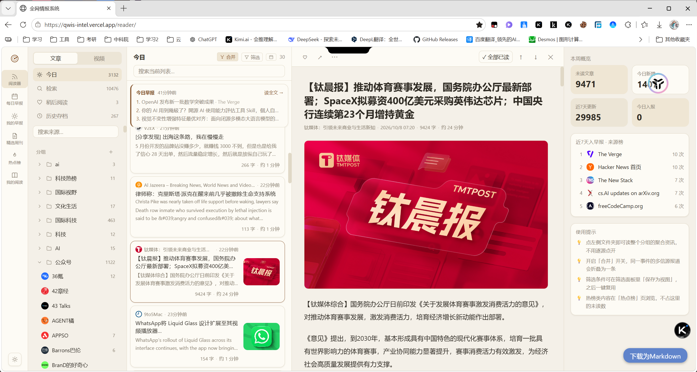

概览侧栏给本周概览（未读 / 今日新增 / 近 7 天更新 / 今日入报）与近 7 天入报来源榜；底部可下载为 Markdown。热榜类内容在热点榜页浏览，不占这里的未读数。

#### 每日早报 `​/daily/`

往期侧栏 + 期号与生成时刻 + 统计卡（候选内容 / 公众号文章 / 视频 / 入报条目 / 统计窗口）+ 栏目胶囊与排序 + 本期索引锚点栏。栏目按全站唯一一份栏目表分组呈现，每条带 AI 评分、摘要、推荐语与标签；「重新生成」按钮在云端**不补抓、无 AI 增强**，与本地端的同名按钮不是同一件事。

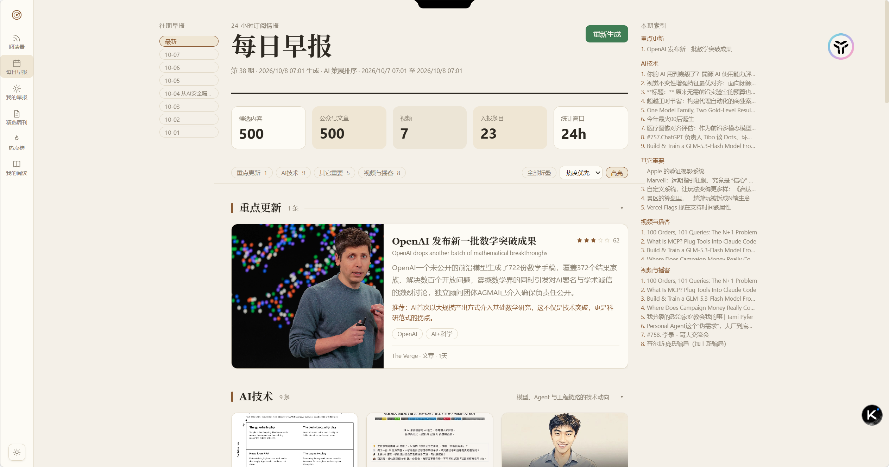

#### 我的早报 `​/mybrief/`

来自你的关注 + 探索位。头部是当期主题标题与今日总结导语（这两样由 AI 产出，不可手改，ADR-23），下方按 全部/文章/视频/播客/推文 分类型。头条卡标注入选理由（如"来自你的关注""关注 +6"）与要点、原文引用。

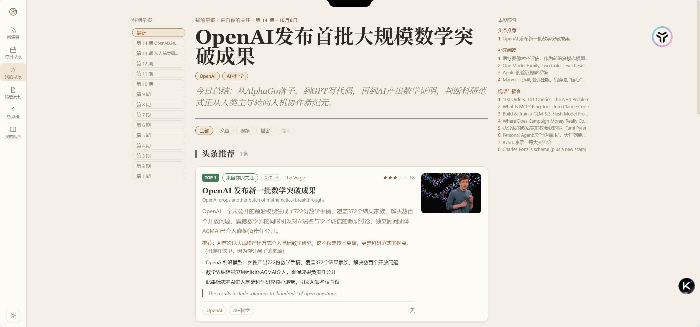

#### 精选周刊 `​/weekly/`

期号切换 + 本周必看条数与区间 + 主题区块（每主题带导语，下挂编号条目）+ 本期索引。骨架不全时页面**直说缺件清单**（如"本期骨架不全：缺 theme，条目为深析产物但无策展主线"），而不是静默降级。

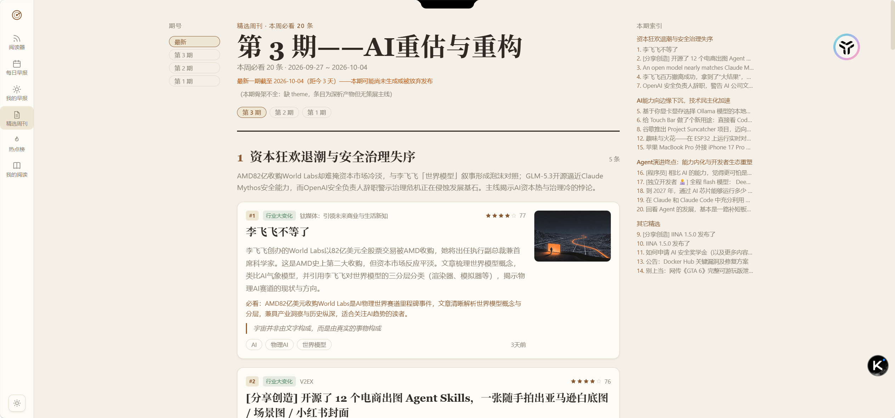

#### 热点榜 `​/hot/` — 四视图

**AI 精选**：当前热点 Top5 + 分类胶囊计数 + 按日分组的时间线，条目带 AI 评分与推荐理由。

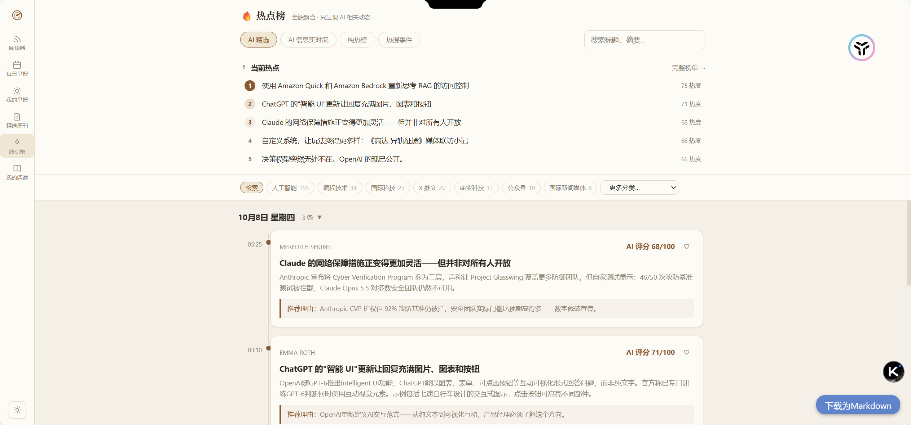

**AI 信息实时流**：只出 AI 相关内容，多一个「来源」下拉，固定周期刷新。

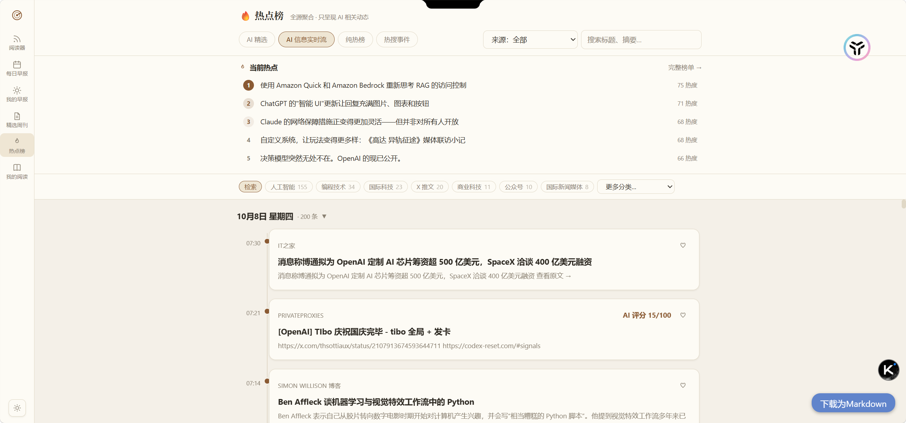

**纯热榜**：全量热榜按分类归组，分类计数明显大于精选视图，条目不带 AI 评分。

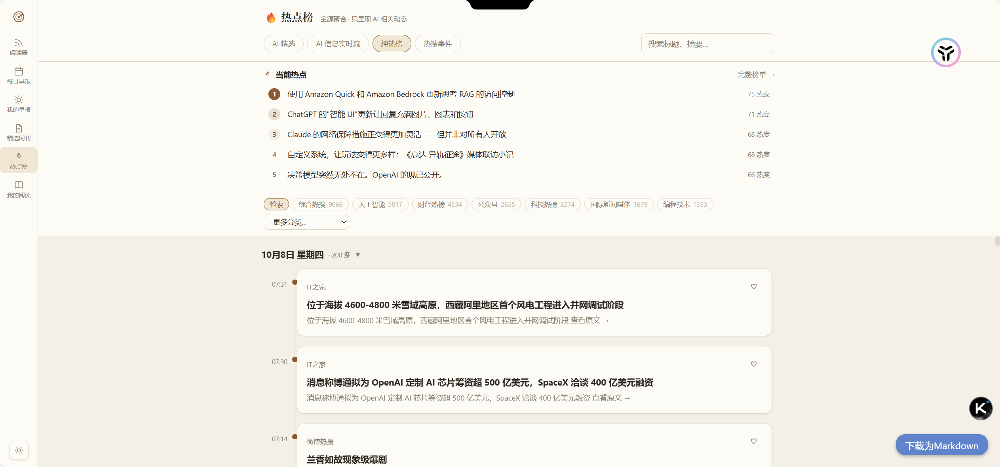

**热搜事件**：事件卡带精选徽章、报道摘要、热度值、分组·信源胶囊、报道篇数与更新时间。页头把口径写明白：runner 定时预聚合、事件窗口与半衰减、趋势图含义、聚合时刻。

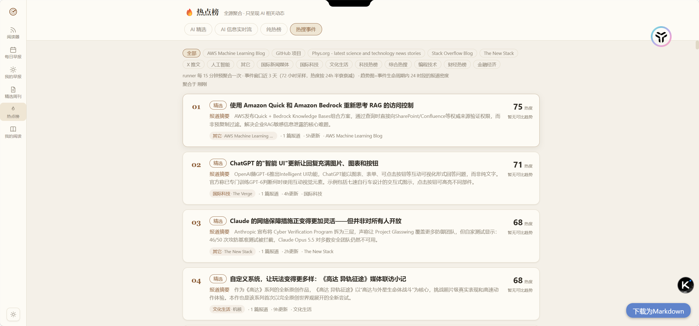

#### 我的阅读 `​/reading/`

阅读沉淀：状态胶囊（全部/已收藏/已读）+ 类型胶囊 + 「含热榜」开关 + 搜索 + 批量管理 + 导出。足迹默认排除热榜与聚合噪声；要把热榜放回来得显式带"含热榜"。

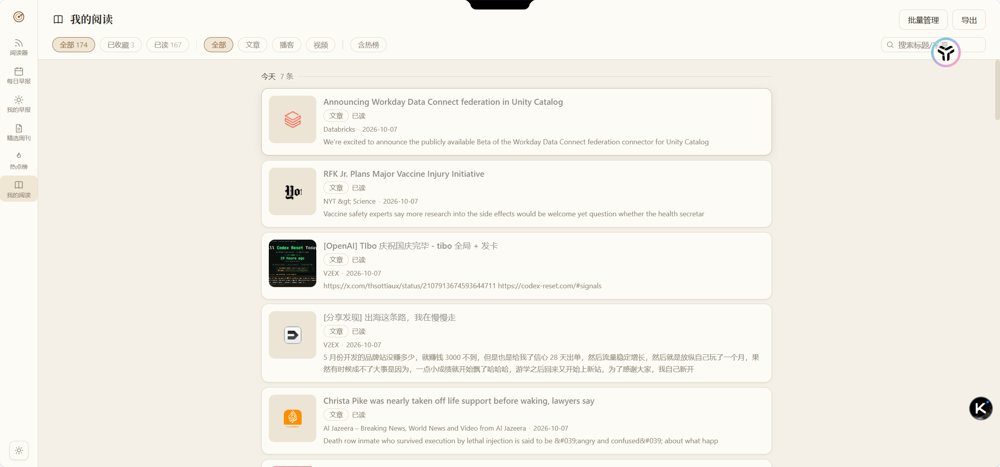

### 管理后台 `​/admin/`

左栏父/子两级导航，**五分区十三子板块**：首页（仪表盘）/ 源（源库·热点榜）/ 报（总览·每日早报·我的早报·周刊）/ AI（AI 配置）/ 系统（数据·监控·报警·自愈·日志）。子板块定位进 URL hash，刷新与直链不丢位置；每个功能块带圆圈问号三段式说明。

#### 首页 · 仪表盘

五张指标大卡（抓取源 / 今日入库 / 熔断中 / Turso Reads / 报错源）每张都标口径且可跳转到对应板块；采集趋势（成功率 + 单轮入库量，只投影末若干轮）、AI 用量（近 24h 按管线分项含失败数）、生成历史末 3 期（三报 tier 与条数）、近 7 天入报 Top5、阅读侧。

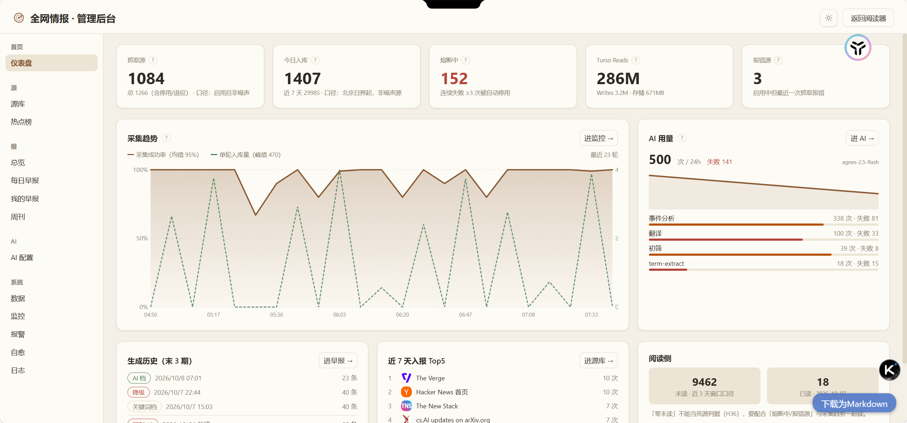

阅读侧那条提示是**有意留白**：「零未读」不能当死源判据，要配合熔断中/报错源与采集趋势一起读。自愈未落地时这里只报数、不放假恢复率。

#### 源 · 源库（五视图）

**健康概览**——组卡网格，每卡一个文件夹：健康进度条、源数与采集间隔、异常数、「管理」主操作 + ⋯ 组级菜单（暂停/频率/备用/屏蔽）。页头常驻四轴语义说明与全站源数/启用/熔断读数。

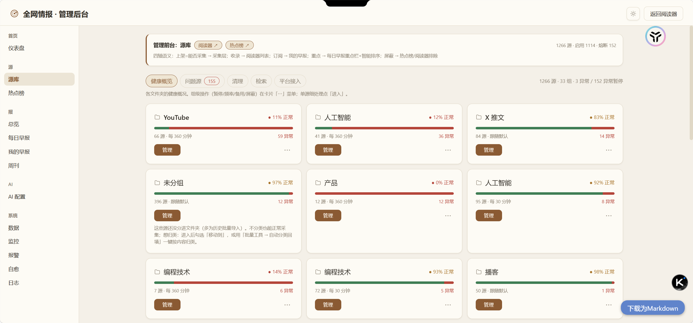

**问题源**——只列需要你处理的（异常 / 异常暂停 / 新增未确认），处理完就从这里消失。顶部「按原因聚类」把同一种病的源放一起、系统级问题排最前；行内给最近错误、加入时间与操作。

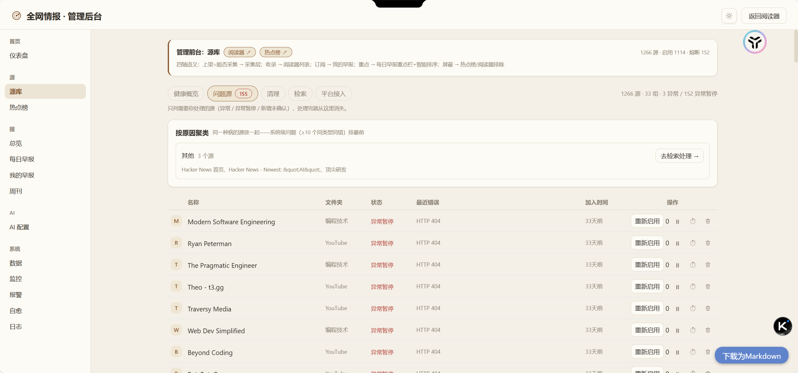

**清理**——库里没内容 / 长期没活到的启用源，批量停用或删除。判据写在页面上，并提醒"将来内容清理放行后，低频活源的旧内容也会过保被删，届时要配合最近入库时间再判"；停用可回退，删除级联清内容不可恢复。

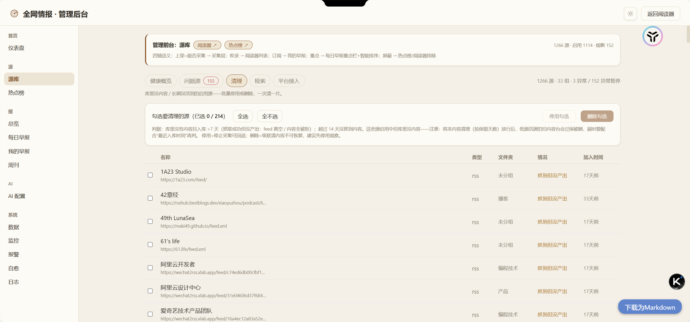

**检索**——干活视图：搜索 + 类型/文件夹/状态三重过滤 + 行内采集开关，勾选后上方浮出批量条与批量工具。

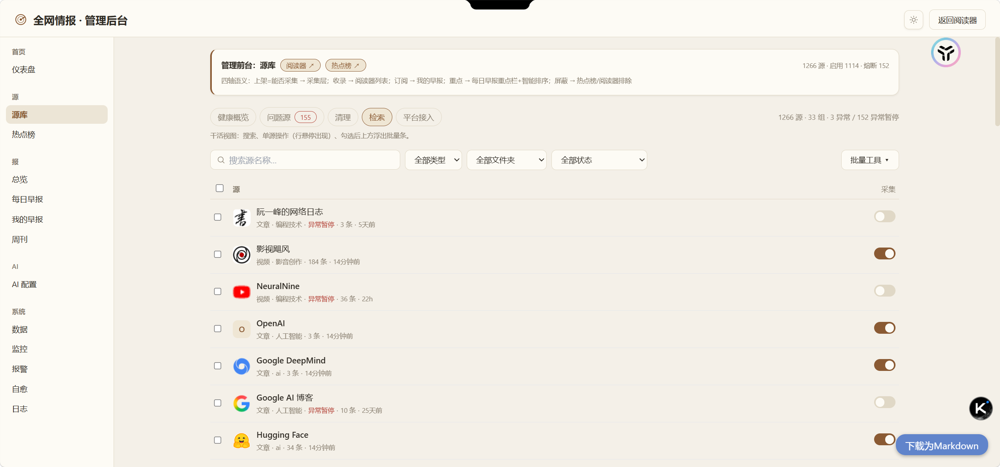

**平台接入**——公众号 RSS 与 B 站的平台级配置（Cookie、间隔、队列）。OPML 运行态为本地调度器专属，云端恒显示占位并说明原因；RSS 刷新与库计数为云端真值。

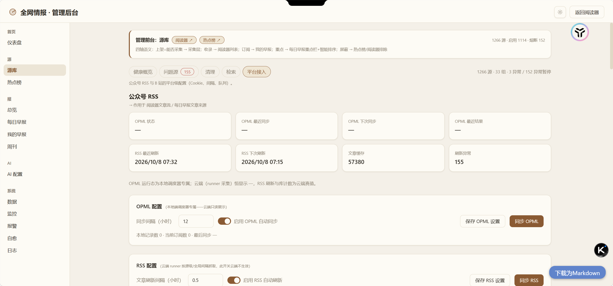

#### 源 · 热点榜策展

开关与门槛 → 热点榜三视图；AIHOT 专属刷新间隔；分类归类规则以**只读**形式展示线上生效配置（胶囊分类 ↔ AIHOT 分类映射）。

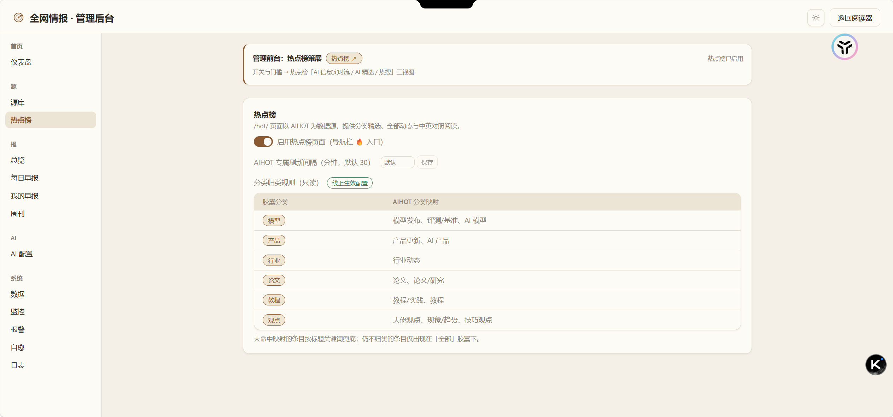

#### 报 · 总览

三报卡（每日早报 / 我的早报 / 精选周刊）各带当期条数与状态徽章（AI 增强 / 正常 / 骨架不全），下接生成历史表——近 7 天逐次给类型、时间、产出与状态（正常 / 降级 / 无 AI）。页头标注"此处全部配置 → runner 生成批次，次日界面可见"。

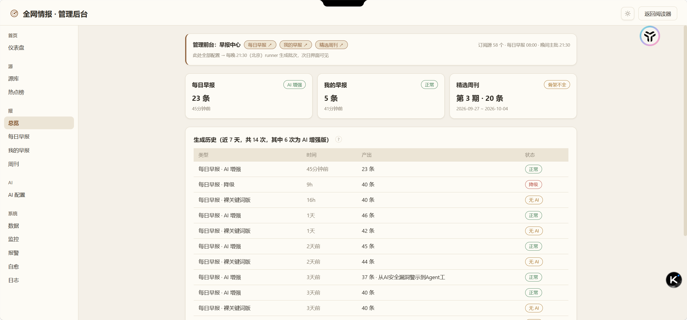

#### 报 · 每日早报

生成管理（自动生成时刻与"生成 > 翻译"保护窗说明）+ 基础设置（统计窗口、每日生成时间）+ **每源每日配额**（进模型前先削减，1~100）+ 公众号文章来源与视频订阅来源（选源器弹窗）+ 栏目管理（AI 动态栏目开关 + 关键词栏目表）。

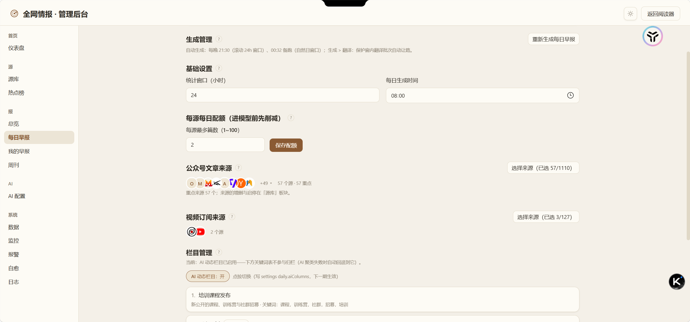

#### 报 · 我的早报

订阅来源（当前生效数 + 管理订阅来源）+ **源贡献榜**（近 7 天）并把"订阅了但近 7 天零贡献"的源点名列出、给出清理入口 + 推送与探索（生成后推送渠道、探索强度低/中/高）+ 关注度权重（订阅源加成、加成上限、入报线）。

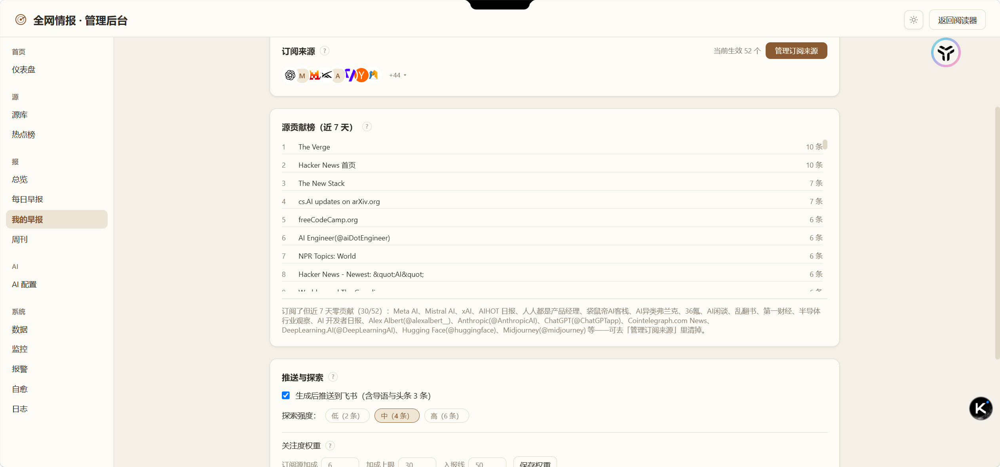

#### 报 · 周刊

诚实页：明确写出"条目不足下限时整期不发布（保住上一期）；栏目与配额写死在生成器里，**无可配置项**"，只给重新生成入口与归档列表（期号、区间、条数、降级标记、删除）。

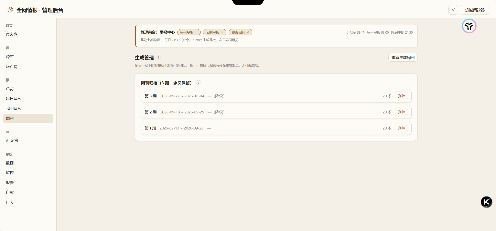

#### AI · AI 配置

一个子板块两个 Zone：

- **AI 能力配置** → 作用于早报策展 / 六维评分 / 摘要（全部 AI 产出页）：供应商、API Key、调用最小间隔、Base URL、模型，配「列出该 API 支持的模型」「测试连通」；当前生效三卡；各管线用量（近 24h 滑动窗，调用/失败/平均耗时逐管线）。
- **翻译 Skill** → 作用于阅读器与早报的中英对照（runner 定时出队）：开关、翻译门槛与五档判据、runner 批量翻译三档提示词（初翻/精翻/润色）、术语表。

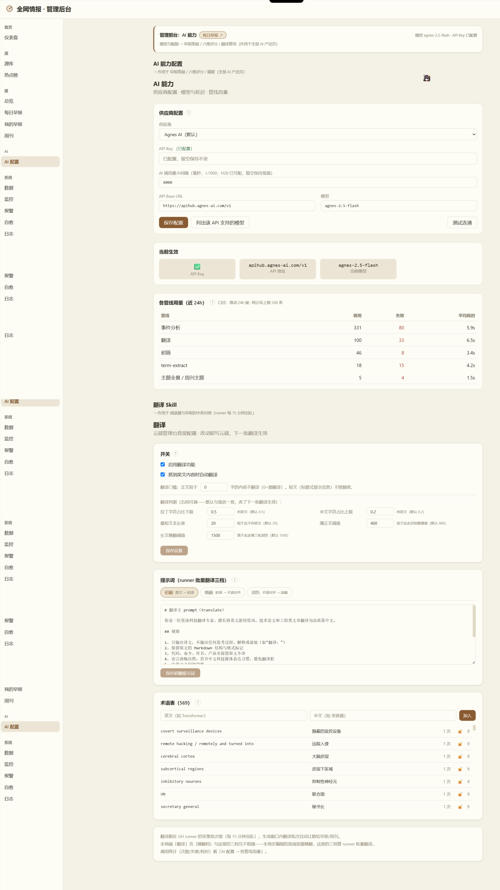

底部把三端翻译的边界写清：批量翻译跑在 runner 采集批次里，本地端「翻译」页（精翻档）与这里的三档**互不相通**；调用统计看「各管线用量」。

### 系统运维

#### 系统 · 数据

整库快照（生成/导入/恢复）——**云端按钮禁用并说明**"这不是还没有快照，而是本部署形态不提供该能力，请用配置备份/恢复"；内容清理（保留天数 + 预览将删条数，且保留天数会自动存进配置）；存储统计（Turso 平台用量 Reads/Writes/Storage 三档 + 逐表条目数 + 占比饼图）。

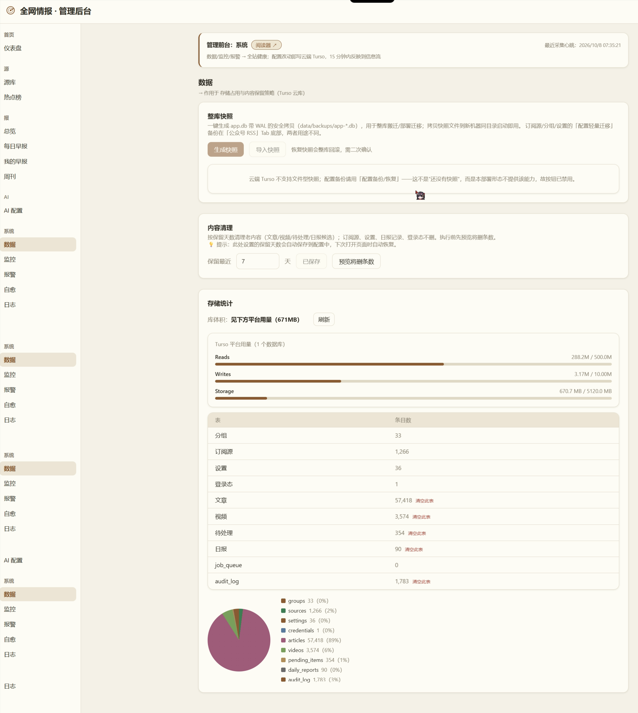

#### 系统 · 监控

采集趋势（心跳追加式历史，成功率与单轮入库量双线，投影末若干轮）+ 健康概览四读数（总源数 / 已启用 / 异常 / 熔断冻结，各带口径）+ 采集失败留痕（runner 批次尾部写入，按批次分组）+ 待处理清单（**云端无此表**，界面直说本地端专属）+ 源健康近似值（按当前状态近似、无历史分母，界面已标注口径）。

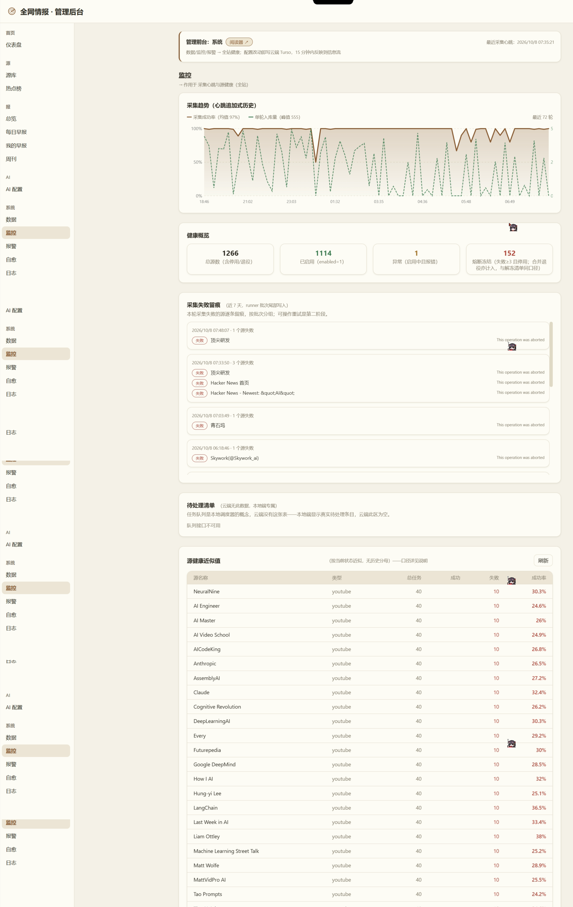

#### 系统 · 报警

报警渠道卡（添加/测试/删除）+ **报警覆盖矩阵**（逐判据给启用状态、最近触发、送达结果）+ 报警事件勾选（同一事件冷却期内只发一次）+ 冷却时长与清空冷却。配置写、定向连通测试、清冷却、报警日志的查看与删除都在云端同权；触发引擎跑在采集批次尾部。

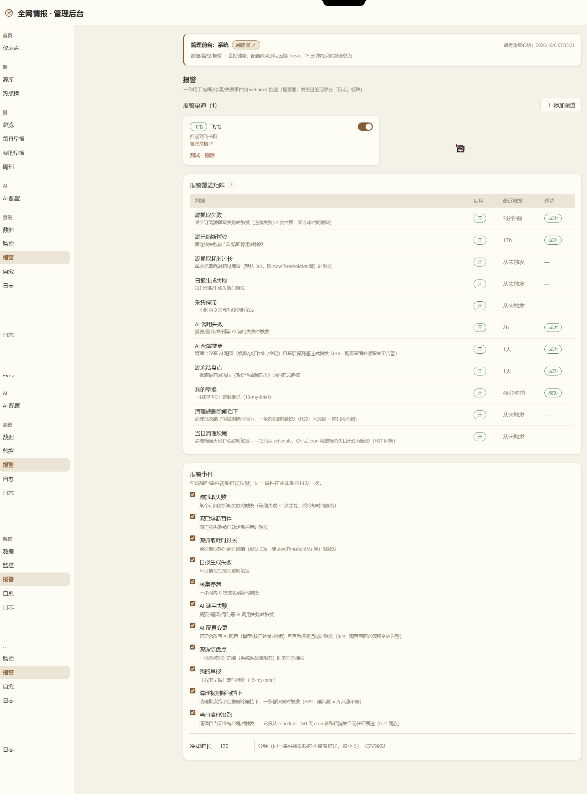

#### 系统 · 自愈

自愈引擎规则卡（冻结超时自动恢复含错峰、连续失败进冷却）+ 一键重启全部异常源 + 三读数（曾被自动恢复 / 恢复后现健康 / 冷却中）+ 四个清单：**恢复后又熔断**（周期性被掐值得保留+降频，或真死源去源库清理）、**恢复后现健康**、**冷却中**（可提前重启）、**已被自动降频**（同型同错达平台级判据时整族降频，恢复后不自动回升）。

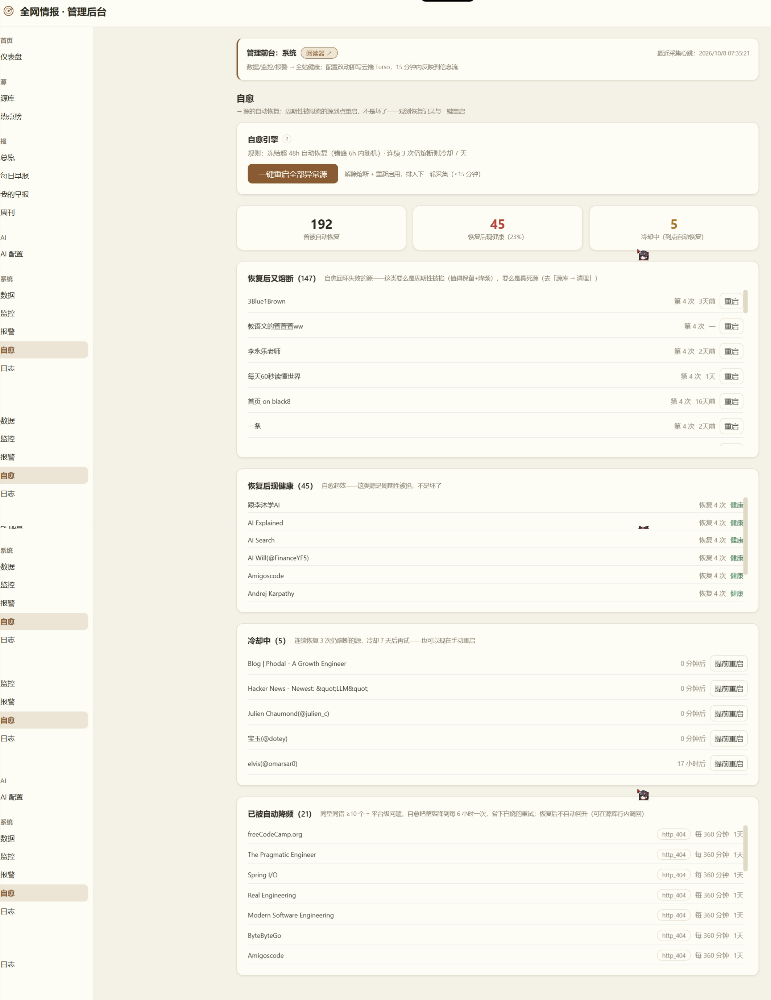

#### 系统 · 日志

观测面：作业运行史（逐作业给最近一次、产出、状态）+ 报警事件流（分页，含事件类型/渠道/送达）+ 数据层失败·坏值回落留痕 + **指路卡**——serverless 无文件系统，三类云端没有库内留痕的日志各有去处：服务器错误 → Vercel Logs、部署失败 → Vercel Deployments、runner 完整日志 → GitHub Actions。

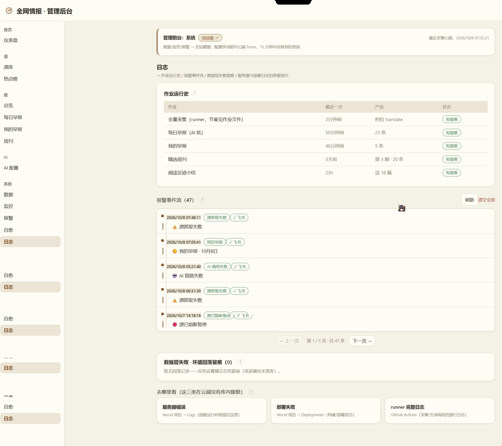

---

## 🚀 快速开始

### 环境要求

- Node.js ≥ 20，npm ≥ 9
- （可选）PM2 — 本地端进程守护
- （可选）Playwright Chromium — 仅抖音采集需要

### 安装与启动

```bash
# 1. 克隆仓库
git clone https://github.com/ghoustghoust/qwis-portal.git
cd qwis-portal

# 2. 安装依赖
npm install

# 3. 配置环境变量
cp .env.example .env      # 按需修改；必需变量清单见 ARCHITECTURE.md §6

# 4. 构建前端
npm run build

# 5. 启动服务
npm start                 # 生产模式
npm run dev               # 开发模式（nodemon 热重载）
```

启动后本地访问：

| 页面 | 地址 |
|---|---|
| 阅读器 | <http://localhost:3000/reader/> |
| 每日早报 | <http://localhost:3000/daily/> |
| 我的早报 | <http://localhost:3000/mybrief/> |
| 精选周刊 | <http://localhost:3000/weekly/> |
| 热点榜 | <http://localhost:3000/hot/> |
| 我的阅读 | <http://localhost:3000/reading/> |
| 管理后台 | <http://localhost:3000/admin/> |

### 云端部署（主部署面）

主部署面是 **Vercel 读层 + GH runner 采集**（ADR-01），本地端是开发与灾备。`git push origin main` 即触发 Vercel 自动部署；采集与三报由 `.github/workflows/collect.yml` 承担。部署与 CI 的操作事实见 `docs/features/deploy-and-ci.md` 与 `docs/RUNBOOK.md`。

把本地端长期跑在服务器上（依赖安装、代理、鉴权豁免等）见 `docs/RUNBOOK.md` §2/§3。

### 测试

```bash
npm test              # 行为锁（回归网）
node smoke-test.js    # 冒烟（生产库副本，零副作用）
```

这两条是**功能验收轮**的门，不是每轮开发必过的门（10-04 锁裁决）。命令各自判什么、怎么取读数，唯一清单在 `docs/FEATURE_MATRIX.md` §1.5。

---

## 🛠 技术栈

| 层级 | 技术 |
|---|---|
| **后端** | Node.js 20+ / Express 4 / better-sqlite3 (WAL) |
| **前端** | React 18 / Vite 5 / Tailwind CSS 3（读者与后台两个独立 bundle，板块级懒加载 + 空闲预热） |
| **采集** | rss-parser / Playwright（仅本地抖音）/ undici (HTTP) |
| **调度** | 本地 node-cron + due 驱动 tick；云端主链路 = GH Actions runner 直写 Turso，双档触发（GH schedule + 外置 HTTP 触发器，ADR-13） |
| **AI** | Agnes 云端（策展 / 六维评分 / 摘要 / 翻译 / 事件分析 / 术语抽取）；降级两段、机翻必带标记 |
| **云端** | Vercel Serverless（读层 + 管理台）/ Turso (libSQL, 东京) / GH Actions runner（采集） |
| **部署** | Vercel（生产读层）+ GitHub Actions（定时采集与生成）/ PM2（本地开发·灾备） |

runner 依赖面只许纯 JS（ADR-21）；不引入工作流编排平台（ADR-19）、不引入搜索引擎栈（ADR-20）。

---

## 📁 项目结构

```
qwis-portal/
├── server/               # 本地 Express（开发与灾备）
│   ├── routes/           # API 路由（22 个域文件）
│   ├── services/         # 采集器 / AI 日报 / 事件聚合 / 报警 / 调度 / 源自动分类 / 队列 / 实时
│   ├── middleware/       # 鉴权中间件（JWT）
│   ├── util/             # HTTP / 日志 / 安全图片代理 / 时间工具
│   ├── db.js             # 本地 better-sqlite3（建表 DDL + 增量迁移）
│   └── index.js          # 入口（代理初始化 → 建表 → 路由 → 鉴权 → 调度器）
├── web/                  # 前端（Vite + React + Tailwind）
│   ├── src/pages/        # Reader / Daily / MyBrief / Weekly / Hot / MyReading / Admin
│   ├── src/components/   # 板块组件（源库五视图 / 三报面板 / 系统五板块 等）
│   ├── src/ui/           # 共享 UI（TagPills / Stars / SourceAvatar / StatCard）
│   ├── index.html        # 读者入口
│   └── admin.html        # 管理后台入口（独立 bundle）
├── api/                  # Vercel 读层
│   ├── [...slug].js      # 主 API（catch-all 路由）
│   ├── collect.js        # 采集函数（手动备份）
│   └── daily-generate.js # 日报生成（手动备份）
├── lib/                  # 三端共用语义（熔断阈值 / AI 相关性 / 热榜事件 / 源四轴 / 媒体 / 文本清洗 / DDL）
├── tools/                # 运维脚本（collect-turso.js = 云端采集主链路）
├── opml/                 # 订阅源清单（wechat2rss / youtube / podcast）
├── config/               # customer-config.json（客户化配置）
├── cloud/                # PHP 队列站点代码
├── tests/                # 行为锁（node:test）
├── static-data/          # 静态导出物
└── docs/                 # 文档（全量地图见 docs/INDEX.md：adr / features / pitfalls / eval 等）
```

---

## ⚙️ 配置说明

### `.env` 环境变量

必需变量的清单与位置矩阵只有一处：`ARCHITECTURE.md` §6（凭据速查在本地件 `docs/HANDOVER.md` §1.5，永不提交）；模板见 `.env.example`。常用项：`PORT`、`AUTH_SECRET`、`ADMIN_USER` / `ADMIN_PASSWORD`、`HTTPS_PROXY`、`TURSO_DATABASE_URL` / `TURSO_AUTH_TOKEN`。

### `config/customer-config.json`

由 `npm run setup:customer` 读取并生成 `.env`：

| 字段 | 说明 |
|---|---|
| `opmlUrl` | 公众号 OPML 订阅地址 |
| `apiToken` | 队列 Token（留空自动生成） |
| `deepseekKey` | AI Key（留空则 AI 功能关闭） |
| `bilibiliCookie` | B站 Cookie（留空走合集 + 搜索兜底） |
| `douyinLoginMode` | 抖音登录方式：`qrcode`（扫码）/ `cookie` |
| `intervals` | 各源刷新间隔 |
| `proxy` | 本机代理地址 |

### 管理后台口令

管理账号来自环境变量 `ADMIN_USER` / `ADMIN_PASSWORD`（本地 `.env` + Vercel env），登录换令牌（ADR-12）。`settings` 表里那个口令哈希键**不是鉴权入口**，只是"不回显"名单的成员——把它设上不会让任何接口放行。

### 凭据一致性（本项目最大血泪坑）

`COLLECT_KEY` / `TURSO_*` 等改值时必须**同批改齐所有持有方**：本地 `.env` + Vercel env + GitHub Secrets + **外置触发器内嵌的那份**（持有方全集见 ADR-12）。漏改任一处会导致全链路 403 停摆。

---

## 🔌 API 端点

读者用的公开只读端点。**"哪端"这一列不能省**——三报里只有每日早报两端同名，我的早报与周刊是云端读层长出来的，本地 Express 没有这两个路由：

| 端点 | 哪端 | 说明 |
|---|---|---|
| `GET /api/meta` | 两端 | 概览读数（含 `commit`，用于确认线上部署版本） |
| `GET /api/articles` | 两端 | 文章列表（默认排除热榜/聚合噪声，支持增量与智能排序） |
| `GET /api/articles/since` | 两端 | 增量拉取（前端固定周期轮询用） |
| `GET /api/videos` | 两端 | 视频列表（游标分页 + 播客并入） |
| `GET /api/hot` | 两端 | 热点榜（精选 / 实时流 / 纯热榜 / 事件榜） |
| `GET /api/daily` | 两端 | 每日早报当期 |
| `GET /api/mybrief` · `/api/weekly` | **仅云端** | 我的早报 / 精选周刊（含各自 `archive` 归档） |
| `GET /api/groups` · `/api/sources` | 两端 | 分组与源列表 |
| `GET /api/status` | 两端 | 系统状态概览 |
| `GET /api/img` | 两端 | 图片代理（防盗链，含 `no-referrer` 处理） |
| `GET /api/reading` | 两端 | 阅读记录 |

公开面由云端读层的 `PUBLIC_GET_PATHS` 白名单与本地端鉴权中间件各自决定，**两份名单不保证逐条相同**；部分 GET 匿名可读但响应会剥离私有块（如早报历史里的订阅画像）。判"某个 GET 到底公不公开"以那端的白名单为准，别从本表推。

**管理端点与写端点不在本文列全**——列在这里必然与代码不一致。权威去处：

- 哪端有什么能力、缺哪个端点 → `docs/FEATURE_MATRIX.md` §1
- 管理端点全表（含鉴权要求）→ 本地件 `docs/HANDOVER.md` §3（含密钥，已 gitignore，不入库）
- 云端读 API 的响应形状 → `docs/contracts/`
- 采集心跳与运维排障入口 `GET /api/health/status` → **需 Bearer**，见 `docs/RUNBOOK.md` §10 与 `AGENTS.md` §4

---

## ❓ 常见问题

### Q: 为什么某个界面上写着"云端不支持 / 本地端专属"？

因为主部署面是 serverless 读层 + runner，**有些能力受形态约束永不做**，不是待办：文件型整库备份与恢复（serverless 文件系统约束）、抖音采集与播放直链（需登录态 / Cookie 风控，ADR-02）。界面把这些写在按钮旁边而不是藏起来，是为了让人知道该去哪一端做。逐项边界见 `docs/FEATURE_MATRIX.md` §2。

### Q: 公众号文章为什么在云端没有增量？

云端两份采集实现都**显式排除**公众号（依赖本地微信 Cookie），本地是唯一能采的一端。后果是云端早报里的公众号文章没有增量，且没有本地回灌云端的通路（ADR-17 的具体代价，不是某次故障）。存量与最新一篇时间现读源表。

### Q: 抖音采集为什么只能在本地运行？

依赖 Playwright + 扫码登录态，**仅本地端，永不上云**（ADR-02）。要长期跑就按 `docs/RUNBOOK.md` §3 托管本地端。

### Q: 微信公众号图片加载不出来？

走 wechat2rss 的 img-proxy，需要 `referrerpolicy="no-referrer"`。服务端图片代理（`/api/img`）已自动处理。

### Q: 源被自动停用了？

熔断机制：源连续失败达阈值（**按类型分档**，唯一实现在 `lib/source-breaker.js`）自动停用。恢复路径有三条：后台「源库 · 问题源」逐个重新启用（启用时清零 fail_count）、「系统 · 自愈」一键重启全部异常源、或等自愈引擎按规则自动恢复（冻结超时恢复 + 连续失败进冷却）。**注意**：同型同错成簇判为平台级问题，不会累加 fail_count、不会集体熔断。

### Q: 如何添加新的 RSS 源？

后台 `/admin/` → 「源 · 源库」→「平台接入」或「检索」视图新增 → 保存后系统自动加入调度队列并尝试自动分类。新源默认未分组，可用「批量工具 → 自动分类回填」按内容归类。

### Q: 海外源（YouTube / X）抓不到内容？

- **本地端**：在 `.env` 配 `HTTPS_PROXY` 指向本地代理；国内服务自动走 `NO_PROXY` 绕过。
- **云端**：runner 海外直连，无需代理。
- **X/Twitter**：依赖第三方 RSSHub 模板（`x.rsshubTemplate`），本仓不自建实例；未配置时源可存可填但抓不到内容。

### Q: 日报没有自动生成？

- **云端**：晚间主批 + 夜间备跑由 runner 生成（时刻以 `.github/workflows/collect.yml` 为唯一事实源）；排查顺序先看后台「系统 · 日志」的作业运行史与「系统 · 监控」的采集心跳，再看 GitHub Actions 运行记录。
- **本地**：检查调度器 `npm run pm2:logs`；手动触发：后台「报 · 每日早报」→「重新生成每日早报」（注意云端那个按钮不补抓、无 AI 增强）。
- **生成历史里同时有"降级 / 关键词档"是正常的**：AI 增强失败不阻断主链路（ADR-26），降级分两段。

### Q: 周刊这一期怎么显示"骨架不全"？

这是**设计行为**，不是故障。骨架缺任一（导语 / 封面主题 / 主线条数不足）时把降级标记写为"是"并附缺件清单，页面直说缺什么；条数不足下限时**整期不发布**、保住上一期。别把它和"我的早报的降级提示恒不亮"混为一谈——那句只适用于我的早报域。

### Q: 如何备份和恢复数据？

- **本地**：后台「系统 · 数据」→「整库快照」生成/导入/恢复（WAL 安全拷贝 → `data/backups/app-*.db`）。
- **云端**：文件型快照返回 501，用**配置备份/恢复**替代（配置存 Turso `settings` 表）；内容表靠转储，见 `docs/RUNBOOK.md` §7。
- **本地 ⇄ 云端没有运行期同步**（ADR-17）：`tools/migrate-to-turso.js` 是一次性迁移动作，不是同步通道。

### Q: 改了配置为什么界面没变？

配置改动写云端 Turso 后，**由下一轮 runner 批次生效**，不是即时。各板块页头都写了这条口径（"次日界面可见""15 分钟内反映到信息流"）。另有一族"界面改了不生效"是**已知缺陷**（部分门槛键没有写入口），不是设计——见 `docs/ISSUES.md` 设置面那一族。

---

## 📋 运维命令速查

日常启停：`npm start` / `npm run dev` / `npm run build`（改了 `web/src` 必须重建）/ `npm run pm2:*`。

**命令的唯一清单**（`npm test`、冒烟、文档门禁、只读巡检、内容转储等各自判什么、怎么取读数）在 `docs/FEATURE_MATRIX.md` §1.5；运维排障命令见 `docs/RUNBOOK.md` §6；每轮交付的准绳见 `AGENTS.md` §3。

---

## 📖 文档索引

**接手本项目先读**（顺序固定，见 `AGENTS.md` §0）：`docs/CLOUD_PIPELINE_GUIDE.md` → `docs/FEATURE_MATRIX.md` → `ARCHITECTURE.md` → `docs/adr/` → `docs/DOC_GOVERNANCE.md`。

| 文档 | 说明 |
|---|---|
| [AGENTS.md](AGENTS.md) | Agent 协作规则（品味 + 强制约束 + 交付链） |
| [ARCHITECTURE.md](ARCHITECTURE.md) | 系统形状与机制 + 决策索引 + 已知坑域索引 |
| [docs/FEATURE_MATRIX.md](docs/FEATURE_MATRIX.md) | **功能矩阵（唯一权威 SSOT）**：哪端有什么、缺哪个端点、命令清单 |
| [docs/CLOUD_PIPELINE_GUIDE.md](docs/CLOUD_PIPELINE_GUIDE.md) | 云端实时链路地图 + 不可破坏的不变量（P0） |
| [docs/adr/](docs/adr/) | 38 份决策件——动方向性的东西之前先查索引 |
| [docs/features/](docs/features/) | 功能规格叙述（采集器 / 调度 / 三报 / 热点榜与周刊 / 源库与自动分类 / 报警事件 / 后台 / 部署 / 设置面 等） |
| [docs/pitfalls/](docs/pitfalls/) | 踩坑库（采集/后端/AI/前端/部署/测试 六域；条数以各域文件为准） |
| [docs/ISSUES.md](docs/ISSUES.md) | 已知问题清单（活文档） |
| [docs/RUNBOOK.md](docs/RUNBOOK.md) | 运维手册 |
| [docs/DOC_GOVERNANCE.md](docs/DOC_GOVERNANCE.md) | 文档清洁与写作尺子（每轮交付末尾必做） |
| [docs/DELIVERY_VERIFICATION.md](docs/DELIVERY_VERIFICATION.md) | 交付验证清单（云端实测怎么打） |
| [docs/EVAL_GUIDE.md](docs/EVAL_GUIDE.md) | 评测现状与重建原则 |
| [docs/NEXT-DEV-REQS.md](docs/NEXT-DEV-REQS.md) | 待开发需求（需求队列 SSOT） |
| [docs/INDEX.md](docs/INDEX.md) | 文档地图（全量索引 + 模块地图） |
| [docs/HANDOVER.md](docs/HANDOVER.md) | 凭据速查 + 管理端点全表 ⚠️ 含敏感凭据，已 gitignore，永不提交 |

---

## ⚠️ 注意事项

- **上公网前必须启用 API 鉴权**：`AUTH_SECRET` 设强随机串，改掉默认 `ADMIN_USER` / `ADMIN_PASSWORD`
- **敏感文件已排除**：`.env`、`data/`、`docs/HANDOVER.md`、`cloud/token.json` 均在 `.gitignore` 中
- **改采集语义必须三处对照**（`server/services/collectors/`、`api/collect.js`、`tools/collect-turso.js`），但**新功能只落它该落的那一端**——云端能做的落读层 + runner 两份，本地按需跟；"本地与云端必须双实现"是门户时代的旧默认，已废
- **better-sqlite3 单进程锁**：不可 cluster 多实例，PM2 配 `instances: 1`
- **bat 文件必须 GBK 编码**：用 `tools/gen_bat.py` 生成，不要手改
- **本文不写死易变值**：源数、条数、阈值、时刻、测试数一律现读（AGENTS.md §2 第 5 条单一事实源）。看到本文某处出现写死值而别处也有一份，就是腐烂信号，按 `docs/DOC_GOVERNANCE.md` 收口

---

## 📄 License

Private — 个人项目，保留所有权利。
