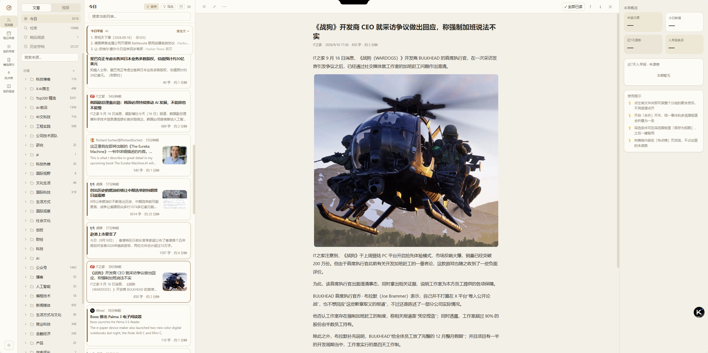
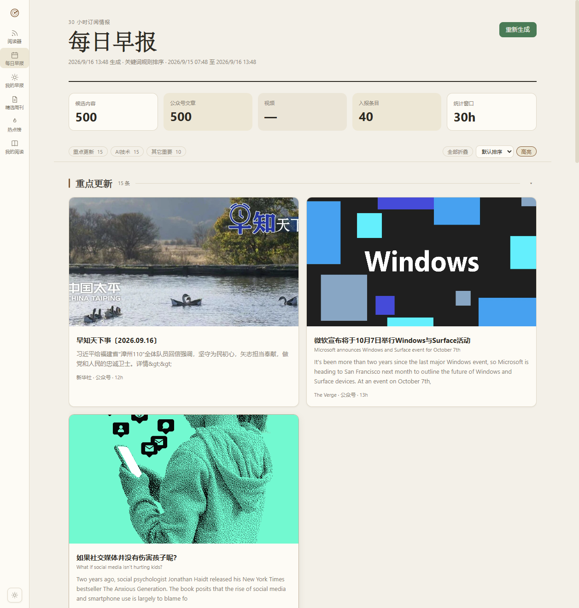
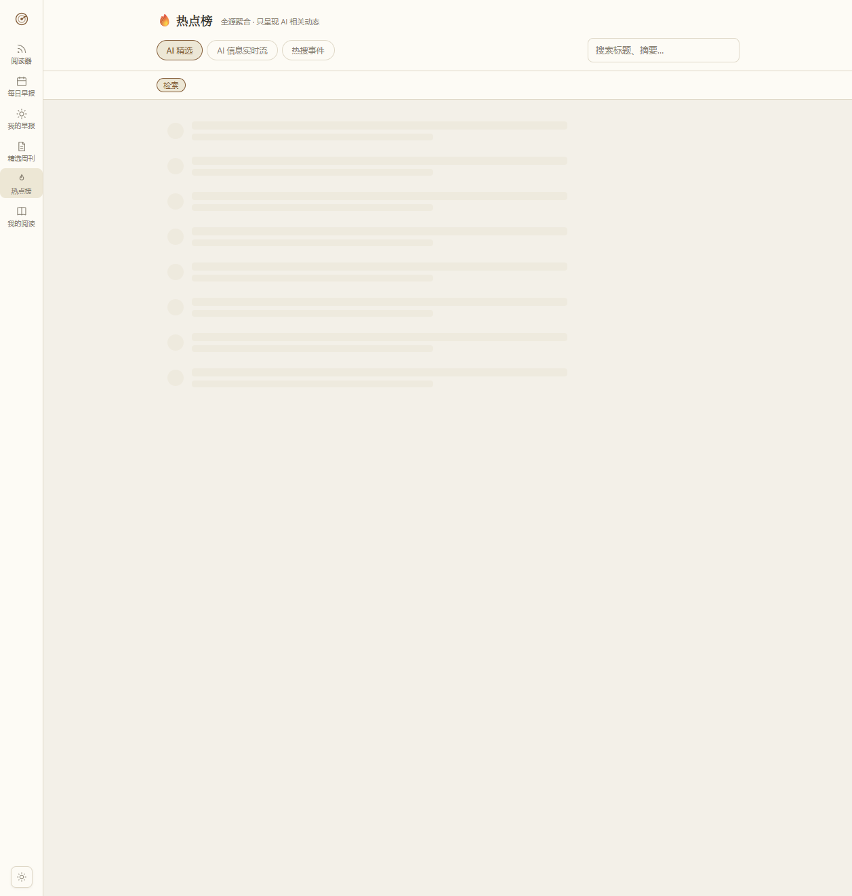
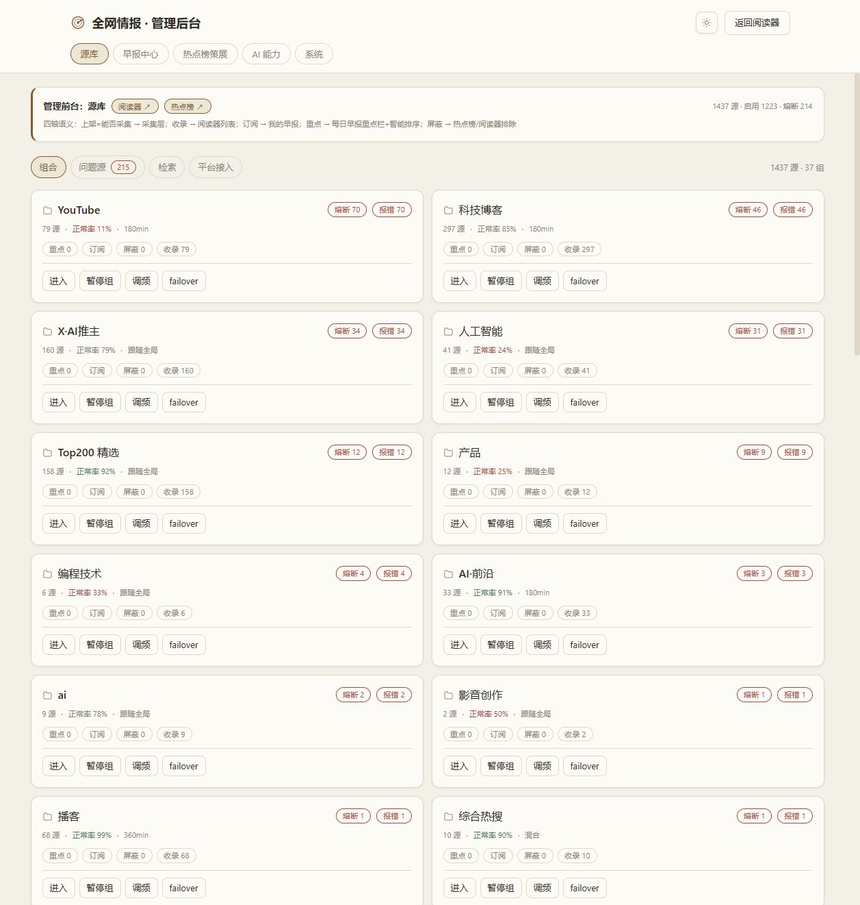
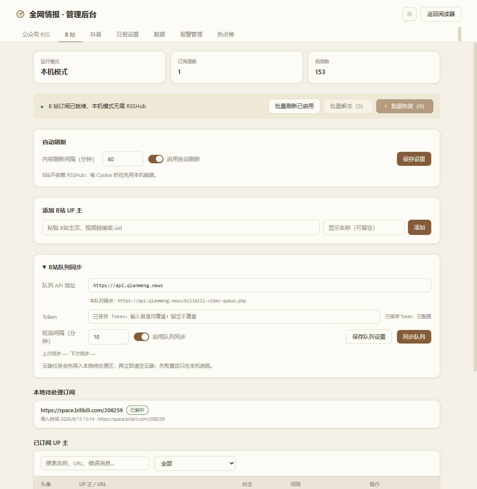

# 全网情报系统 (QWIS) — 项目状态说明

> **Q**uan**W**ang **I**ntel **S**ystem — 私人 AI 情报阅读器
> 最后更新：2026-09-06

---

## 一、系统架构概览

```
──────────────────────────────────────────────────────────────┐
│                      本地主系统 (生产环境)                      │
│                                                              │
│  ┌─────────────┐    ┌──────────────┐    ┌────────────────┐  │
│  │  Express     │    │  Vite + React │    │  PM2 进程守护   │  │
│  │  :3000       │◄──►│  Tailwind CSS │    │  (单实例 fork)  │  │
│  └──────┬──────┘    └──────────────┘    └────────────────┘  │
│         │                                                    │
│  ┌──────▼──────┐    ┌──────────────┐    ┌────────────────┐  │
│  │  better-    │    │  采集适配器    │    │  云端 PHP 队列   │  │
│  │  sqlite3    │    │  (Registry)   │    │  (手机/桌面提交) │  │
│  │  WAL 模式   │    │              │    │                │  │
│  └─────────────┘    └──────────────┘    └────────────────┘  │
└──────────────────────────────────────────────────────────────┘

┌──────────────────────────────────────────────────────────────┐
│                  Vercel Portal (冻结态)                        │
│                                                              │
│  ┌─────────────┐    ──────────────┐    ┌────────────────  │
│  │  Serverless  │    │  读者前端     │    │  Turso (东京)   │  │
│  │  catch-all   │    │  (共享构建)   │    │  异步读优先     │  │
│  └─────────────┘    ──────────────┘    └────────────────  │
└──────────────────────────────────────────────────────────────┘
```

**核心决策**：目标云端形态为 **宝塔/自有服务器全量部署**（Express + SQLite + 抖音 Playwright 全部上服务器），Vercel portal 已进入冻结态，迁移完成后将整体退役。

### 技术栈

| 层级 | 技术 |
|------|------|
| 后端 | Node.js 20+ / Express 4 / better-sqlite3 (WAL) |
| 前端 | React 18 / Vite 5 / Tailwind CSS 3 |
| 采集 | rss-parser / Playwright (抖音) / undici (HTTP) |
| 调度 | node-cron / 自定义 due 驱动 tick 调度器 |
| 云端 | Vercel Serverless / Turso (libSQL) / PHP 队列 |
| 部署 | PM2 (fork 模式单实例) / Nginx 反代 |

---

## 二、核心功能清单

### 2.1 数据采集（Registry 模式）

系统采用 **适配器登记中心** 架构，按类型注册采集器：

| 源类型 | 适配器 | 说明 |
|--------|--------|------|
| **RSS** | `rss/index.js` | 通用 RSS/Atom，含 `content:encoded` 全文保留、ETag 304 短路、charset 嗅探 (GBK/Big5)、Readability 正文提取 |
| **公众号** | 走 RSS 适配器 | wechat2rss 托管 RSS（375 源），图片由对方 img-proxy 代理 |
| **B 站** | `bilibili/index.js` | wbi 签名（30min 缓存）、合集/搜索兜底、匿名 buvid Cookie、playurl 直链 |
| **抖音** | `douyin/index.js` | Playwright headless + RENDER_DATA 解析、严格串行 ≥10s 间隔、扫码登录（有头浏览器，5min 超时） |
| **热榜** | `hotlist/index.js` | newsnow API + 60s API、热度归一化、正文补抓限 10 条 |
| **YouTube** | RSS 别名 | 走官方频道 RSS，需代理可达 |
| **X/Twitter** | RSSHub | 依赖第三方 RSS 服务将时间线转为 RSS |

### 2.2 调度引擎

- **due 驱动 tick**：每 60s 扫描到期源，ticking 守卫防并发，inFlight Set 防同源重复抓取
- **全文补抓**：每 6h（02/08/14/20 点）补抓 <1000 字符的薄内容，限速 2s/条
- **OPML 同步**：每 12h 自动同步 bestblogs OPML 源清单
- **队列轮询**：每 10min 拉取云端 PHP 队列（B 站/抖音/公众号三队列）
- **门户同步**：每 2h 同步快照到 Vercel portal
- **数据清理**：每 24h 按 retentionDays 清理过期数据
- **健康自检**：每 5min 检测采集停滞（启动 30min 后生效）
- **启动恢复**：自动恢复中断的 bilibili/douyin pending 任务

### 2.3 日报生成

- **默认四栏目**：培训课程 / 重点更新 / AI 技术 / 其它重要
- **流程**：collectCandidates → classify（关键词分类）→ dedupAndCap（Jaccard ≥0.5 去重 + 同源限流 3 条）→ 出库安检（乱码/风控错误页过滤）
- **破茧栏**：事件聚合引擎，与用户常读分组交集最小的 Top5 事件
- **生成时间**：默认每天 08:00，可配置

### 2.4 热点榜

- **AIHOT 聚合源**：extra.aggregator=1 的源文章，分类映射六胶囊（模型/产品/行业/论文/教程/观点）
- **事件榜**：近 72h 全域条目 Jaccard(≥0.4) 聚类，热度 = Σ权重 × 24h 半衰 × 1.5^(信源数-1)，缓存 5min
- **enrich 管线**：pending_items → 串行详情页解析 → RSC payload 还原 → 富字段入库

### 2.5 报警系统

- **7 渠道**：钉钉 / 企微 / 飞书 / Server酱 / Bark / Telegram / 自定义 webhook
- **4 事件**：源熔断 / 采集停滞 / 队列异常 / 系统错误
- **防骚扰**：120min 冷却期 + 代理失败直连重试
- **自动清理**：7 天过期日志自动清理

### 2.6 队列同步（云端 PHP → 本地）

- 手机端/桌面端通过 HTTP Shortcuts 提交链接到云端 PHP 队列
- 本地 poller 每 10min 拉取 → 写入 pending_items → 清空云端
- 支持 B 站视频、抖音视频、公众号文章三队列

### 2.7 数据管理

- **整库快照**：WAL 安全 backup → `data/backups/app-*.db`
- **配置轻量迁移**：仅导出 sources/groups/settings JSON
- **按天清理**：可配置 retentionDays（默认 7 天）
- **上传导入**：文件名白名单 + SQLite 头校验 + 同名拒绝

### 2.8 熔断机制

- 源连续失败 3 次自动 `enabled=0`（熔断）
- **统一解冻语义**（`store.unfreezeSource`）：enabled=1 + fail_count=0 + 清 lastError，保留 intervalMin/etag
- 入口：管理台「批量恢复」按钮 / CLI `ops-toolkit.js unfreeze` / 单源 toggle

---

## 三、部署方式

### 3.1 本地开发 / 生产（Windows）

```bash
# 一键启动（含健康检查、自动开浏览器）
start-all.bat

# 重启（按 3000 端口找 PID，需管理员）
restart-server.bat

# 前端修改后重建
npm run build

# 运行测试
npm test          # 回归测试
node smoke-test.js  # 冒烟（生产库副本，零副作用）
```

### 3.2 宝塔 / 服务器部署（PM2）

```bash
# 1. 上传代码（排除 node_modules/ data/ .env portal/ archive/）
# 2. 安装依赖
npm install --production

# 3. 抖音功能需 Playwright（约 300MB）
npx playwright install chromium

# 4. 配置 .env（PORT / HTTPS_PROXY 等）

# 5. 构建并启动
npm run build
npm run pm2:start
pm2 save
pm2 startup  # 开机自启

# 6. Nginx 反代 http://127.0.0.1:3000，client_max_body_size 10m
```

### 3.3 云端 Vercel Portal（冻结态）

- 单一 catch-all Serverless Function：`portal/api/[...slug].js`
- 读 Turso 数据库优先，静态 JSON 快照兜底（`portal/public/data/`）
- 图片代理走 `_safeimg.js`（SSRF 防护 + 7 天缓存）
- 管理后台有 httpOnly cookie 口令鉴权
- **冻结决策**：迁移完成前只修安全项，功能语义不再逐条对齐本地

### 3.4 云端 PHP 队列（可选）

`cloud/` 下 5 个文件传到任意 PHP 站点根目录即用，Token 即全部鉴权。

---

## 四、页面截图

### 4.1 阅读器首页（ReaderPage）

`/reader/` — 文章/视频双 Tab + 分组导航 + 未读计数 + 源级状态显示



### 4.2 每日情报页（DailyPage）

`/daily/` — 四栏目布局（培训课程/重点更新/AI技术/其它）+ 统计卡片 + 破茧栏



### 4.3 热点榜页（HotPage）

`/hot/` — 精选/全部动态/热点榜三 Tab + 六分类胶囊（模型/产品/行业/论文/教程/观点）+ 时间线



### 4.4 管理后台（AdminPage）

`/admin/` — 7 Tab（公众号 RSS / B 站 / 抖音 / 日报设置 / 数据 / 报警管理 / 热点榜）



### 4.5 队列配置面板（QueuePanel）

嵌入 B 站/抖音/公众号 Tab 内 — 云端队列 API 地址 + Token + 轮询间隔 + 同步按钮



### 4.6 微信读书授权页（WereadTab）

> ⚠️ WereadTab 仅存在于 Vercel portal 管理后台（`portal/src-admin/App.jsx`），本地系统无此 Tab。
> we-mp-rss 自建引擎已于 2026-09-04 退役，公众号职责由 wechat2rss 托管 RSS 接替。
> 此 Tab 为历史遗留，随 portal 整体退役将自然消解。

---

## 五、已知限制与注意事项

### 5.1 平台限制

| 限制 | 说明 |
|------|------|
| **抖音采集仅本地** | 需要 Playwright 有头浏览器 + 登录态，云端无法运行 |
| **B 站 Cookie 解析** | 无 Cookie 时走合集+搜索兜底；风控 -352 时自动降级 |
| **海外源需代理** | YouTube/X 等需配 `HTTPS_PROXY` 环境变量，取决于服务器地域 |
| **微信公众号图片** | 走 wechat2rss 的 img-proxy（单点依赖，已知情接受） |
| **Vercel 函数限制** | Hobby 限 12 个函数，故用 catch-all 单函数路由 |

### 5.2 技术债务

| 项目 | 状态 |
|------|------|
| **云端/本地语义漂移** | portal 采集代码是本地移植副本（非同步），冻结期间不一致 |
| **score 列语义混用** | hotlist 热度与 AIHOT 评分共用 articles.score 列 |
| **侧栏无虚拟化** | 500+ 行当前量级可接受，未做虚拟滚动 |
| **smoke-test 安慰剂断言** | 4 个恒真断言，断言质量待提升 |
| **本地 API 无鉴权** | 既有设计（个人工具），公网暴露前必须启用 API_TOKEN |

### 5.3 安全注意

- **上公网前必须启用 API 鉴权**：当前本地 `/api/*` 统一放行（含上传/恢复/删源等写接口）
- **敏感文件已排除**：`cloud/token.json`、`.env`、`data/` 均在 `.gitignore` 中
- **bat 文件必须 GBK 编码**：用 `tools/gen_bat.py` 生成，不要手改

### 5.4 已知坑（血泪史精选）

1. **better-sqlite3 编号参数 `?1 ?2 ?3` 不支持位置绑定** → 一律用匿名 `?`
2. **异步回调内的同步 DB 操作必须 try/catch** → prepare 抛错可崩进程
3. **pending_items 表只有 6 列**（无 source_id/created_at），文章关联经 url JOIN
4. **调度器串行是有意的** → 抖音/B站并发会被秒封
5. **mmbiz.qpic.cn 图片防盗链** → 需 `referrerpolicy="no-referrer"` + 服务端代理

---

## 六、目录结构

```
全网情报系统/
├── server/           # Express 后端
│   ├── routes/       # 19 个 API 路由（含 auth/sourcelib/reading）
│   ├── services/     # 采集器 / AI日报 / 事件聚合 / 报警 / 调度 / 源自动分类
│   ├── cloud/        # 双模式异步数据层（SQLite / Turso）
│   ├── middleware/   # 鉴权中间件（JWT）
│   ├── util/         # HTTP / 日志 / 安全图片代理 / 时间工具
│   ├── db.js         # 本地 better-sqlite3（9 张表 DDL + 增量迁移）
│   └── index.js      # 入口（代理初始化 → 建表 → 路由 → 鉴权中间件 → 调度器）
├── web/              # 主前端（Vite + React + Tailwind）
│   ├── src/
│   │   ├── pages/    # ReaderPage / DailyPage / HotPage / AdminPage / MyReadingPage
│   │   ├── components/ # Sidebar / ArticleList / SourceLibraryTab / FilterPanel / 各 Tab 组件
│   │   ├── ui/       # 共享 UI 组件（TagPills / Stars / SourceAvatar / StatCard）
│   │   ├── api.js    # API 客户端（自动注入 Bearer token）
│   │   └── main.jsx  # 入口（IconRail 导航 + pathname 路由）
│   ├── index.html    # 读者入口
│   └── admin.html    # 管理后台入口（独立 bundle）
├── portal/           # Vercel 项目（冻结态，独立 git 仓库）
│   ├── api/          # Serverless Functions
│   ├── src-admin/    # 云端管理后台
│   └── public/data/  # 静态快照兜底
├── cloud/            # PHP 队列（Token 鉴权 + flock 原子操作）
├── config/           # customer-config.json（客户化配置）
├── opml/             # bestblogs 源清单（wechat2rss / youtube / podcast）
├── tools/            # 运维脚本
├── tests/            # 回归测试（node:test，189 项）
├── docs/             # 文档（RUNBOOK / 截图等）
├── archive/          # 历史资产（报告 / 规格 / 分析）
└── trash/            # 退役代码（we-mp-rss 等）
```

---

## 七、快速上手

### 新接手者 Checklist

1. **读文档顺序**：本文档 → `ARCHITECTURE.md` → `docs/RUNBOOK.md` → `docs/INDEX.md`
2. **启动系统**：`start-all.bat` → 浏览器打开 `http://localhost:3000/reader/`
3. **管理后台**：`http://localhost:3000/admin/`（7 Tab 管理所有源和配置）
4. **修改前端**：改 `web/src/` → `npm run build` → 浏览器 Ctrl+F5
5. **修改后端**：改 `server/` → `restart-server.bat`（需管理员）
6. **跑测试**：`npm test`（全绿才算完）
7. **不要依赖** `.qoder/repowiki/`（已过期，以代码为准）

### 关键约定

- 主系统 `server/` 与 portal `portal/` **共享语义但不共享进程**，改一边要想另一边
- 新功能默认本地 API + 云端 API 双实现，前端一套
- 不要引入需要无头浏览器的云端功能（抖音是本地专属）
- 提交前：`npm test` 全绿 + `npm run build` 无错 + 涉及云端跑 `audit-cloud.js`

---

## 八、修复历史

| 轮次 | 日期 | 范围 | 验证 |
|------|------|------|------|
| A 类硬伤 | 2026-09-04 | 12 项现存代码级硬伤 + 8 项对抗性审查发现 | npm test 92/92 |
| B/C 类修复 | 2026-09-04 | 冻结期安全项 + 本地功能冲突 | npm test 105/105 |
| we-mp-rss 退役 | 2026-09-04 | 公众号迁移到 wechat2rss + 375 源导入 | npm test 107/107 |
| D 类文档收口 | 2026-09-04 | 文档可信度分级 + 功能完整性检测 24/25 | 生产库实测 |
| Phase 6-9 重构 | 2026-09-05 | 采集层/调度层拆分 + 任务队列 + 事件解耦 | npm test 168/168 |
| 十期·源库+自动分类 | 2026-09-05 | 源库管理 Tab + 源自动分类 + 视觉精修 | npm test 168/168 |
| 知识库审计更新 | 2026-09-06 | repowiki 全面审计 + 知识卡片修正 | npm test 189/189 |

详见 `archive/docs-deprecated/A_CLASS_FIX_REPORT.md`。
